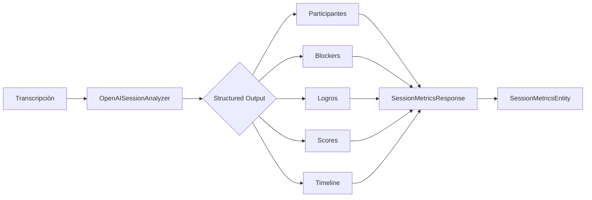
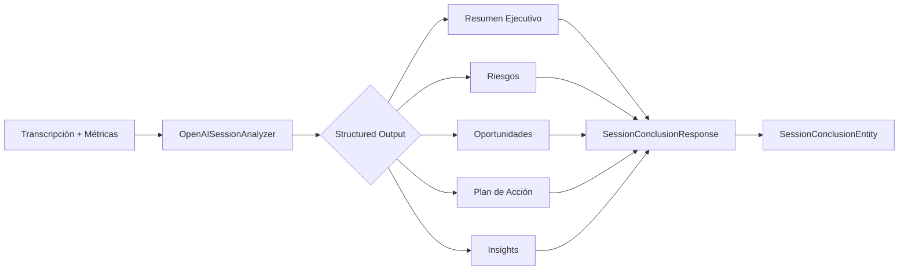

# Session Analysis Infrastructure

Implementación de análisis de sesiones mediante IA (LLM) para extraer métricas estructuradas y generar conclusiones ejecutivas.

## Arquitectura

```
SessionAnalysisPort (Domain Port)
       ↑
       │ implements
       │
OpenAISessionAnalyzer (Infrastructure)
```

## Componentes

### 1. SessionAnalysisPort
**Ubicación**: `core/domain/ports/SessionAnalysisPort.ts`

Port (interfaz) que define el contrato para análisis de sesiones mediante IA.

**Métodos principales**:
- `analyzeMetrics()`: Extrae métricas estructuradas de transcripciones
- `analyzeConclusion()`: Genera conclusiones ejecutivas y recomendaciones
- `isReady()`: Verifica disponibilidad del analizador
- `getModelInfo()`: Información del modelo y capacidades

### 2. OpenAISessionAnalyzer
**Ubicación**: `infrastructure/session-analysis/OpenAISessionAnalyzer.ts`

Implementación que usa OpenAI API (GPT-4, GPT-4o) con Structured Outputs.

**Características**:
- ✅ JSON Schema para garantizar formato correcto
- ✅ Prompts especializados para transcripciones de sesiones
- ✅ Análisis contextual (no solo keywords)
- ✅ Validación de respuestas
- ✅ Manejo de errores robusto

### 3. SessionAnalyzerFactory
**Ubicación**: `infrastructure/session-analysis/SessionAnalyzerFactory.ts`

Factory para crear instancias de analizadores con configuración flexible.

## Uso Básico

### Opción 1: Creación Manual

```typescript
import { OpenAISessionAnalyzer } from './infrastructure/session-analysis';

const analyzer = new OpenAISessionAnalyzer(
  process.env.OPENAI_API_KEY!,
  'gpt-4o',           // modelo
  16000,              // maxTokens
  0.3                 // temperature
);

// Analizar métricas
const metricsResponse = await analyzer.analyzeMetrics({
  transcript: transcriptionText,
  overallSentiment: SentimentType.POSITIVE,
  confidence: 0.85,
  clientName: 'Banorte',
  documentName: 'CelulaMiercoles.pdf',
});

// Generar conclusión
const conclusionResponse = await analyzer.analyzeConclusion({
  transcript: transcriptionText,
  overallSentiment: SentimentType.POSITIVE,
  confidence: 0.85,
  metrics: sessionMetrics,
  clientName: 'Banorte',
  documentName: 'CelulaMiercoles.pdf',
});
```

### Opción 2: Usando Factory

```typescript
import { SessionAnalyzerFactory } from './infrastructure/session-analysis';

// Desde configuración
const analyzer = SessionAnalyzerFactory.create({
  provider: 'openai',
  openaiApiKey: process.env.OPENAI_API_KEY,
  openaiModel: 'gpt-4o',
  maxTokens: 16000,
  temperature: 0.3,
});

// Desde variables de entorno
const analyzer = SessionAnalyzerFactory.createFromEnv();
```

### Opción 3: En Services (Recomendado)

```typescript
import { SessionMetricsService } from './core/application/services';
import { SessionAnalyzerFactory } from './infrastructure/session-analysis';

// En DIContainer o setup
const sessionAnalyzer = SessionAnalyzerFactory.createFromEnv();
const metricsService = new SessionMetricsService(
  metricsRepository,
  sessionAnalyzer  // Opcional: si no se pasa, usa reglas
);

// El servicio usa AI automáticamente
const metrics = await metricsService.calculateSessionMetrics(analysis);
```

## Variables de Entorno

```bash
# Provider (openai | ollama)
SESSION_ANALYZER_PROVIDER=openai

# OpenAI Configuration
OPENAI_API_KEY=sk-...
OPENAI_MODEL=gpt-4o

# Optional: Token limits and temperature
SESSION_ANALYZER_MAX_TOKENS=16000
SESSION_ANALYZER_TEMPERATURE=0.3

# Ollama Configuration (para uso futuro)
OLLAMA_BASE_URL=http://localhost:11434
OLLAMA_MODEL=llama2
```

## Flujo de Análisis

### Métricas de Sesión



### Conclusión de Sesión



## Prompts y Análisis

### Análisis de Métricas

El LLM analiza:

1. **Participantes**: Extrae nombres de timestamps
2. **Temas**: Clasifica en problem/achievement/coordination
3. **Blockers**: Identifica con contexto y prioridad real
4. **Logros**: Detecta menciones de éxitos y métricas positivas
5. **Action Items**: Extrae tareas con asignees
6. **Scores**: Calcula basado en análisis holístico
7. **Timeline**: Marca eventos clave y cambios de sentimiento

**Ejemplo de input**:
```
"Leonardo: NPS sobrepasa 90 puntos, muy satisfactorio"
```

**Output del LLM**:
```json
{
  "achievements": [{
    "description": "NPS sobrepasa los 90 puntos",
    "impact": "high",
    "sentiment": 6,
    "metric": "NPS",
    "value": 90
  }],
  "scores": {
    "productivity": 85,
    "effectiveness": 80,
    ...
  }
}
```

### Análisis de Conclusiones

El LLM genera:

1. **Resumen Ejecutivo**: Síntesis de 2-3 oraciones
2. **Riesgos**: Con impacto y recomendaciones
3. **Oportunidades**: Identificadas del contexto
4. **Plan de Acción**: Inmediato/corto plazo/continuo
5. **Insights Segmentados**: Por audiencia
6. **Clima del Equipo**: Evaluación cuantitativa

## Ventajas sobre Lógica Hardcodeada

| Aspecto | Lógica Hardcodeada | LLM Analysis |
|---------|-------------------|--------------|
| Detección de blockers | Keywords fijos | Contexto completo |
| Priorización | Umbral fijo (60, 80) | Basada en impacto real |
| Logros | Palabras clave simples | Detecta menciones implícitas |
| Scores | Fórmulas fijas | Análisis holístico |
| Adaptabilidad | Requiere código nuevo | Se adapta automáticamente |

## Testing

```typescript
// Mock para testing
const mockAnalyzer: SessionAnalysisPort = {
  async analyzeMetrics(req) {
    return mockMetricsResponse;
  },
  async analyzeConclusion(req) {
    return mockConclusionResponse;
  },
  async isReady() {
    return true;
  },
  getModelInfo() {
    return { name: 'mock', provider: 'test', capabilities: [] };
  },
};

const service = new SessionMetricsService(repository, mockAnalyzer);
```

## Extensibilidad

### Agregar nuevo provider (ej: Anthropic Claude)

1. Crear `AnthropicSessionAnalyzer.ts` que implemente `SessionAnalysisPort`
2. Agregar al `SessionAnalyzerFactory`
3. No se requieren cambios en services o casos de uso

```typescript
// AnthropicSessionAnalyzer.ts
export class AnthropicSessionAnalyzer implements SessionAnalysisPort {
  // ... implementación
}

// SessionAnalyzerFactory.ts
case 'anthropic':
  return this.createAnthropicAnalyzer(config);
```

## Troubleshooting

### Error: "Session metrics analysis failed"

- Verificar API key válida
- Revisar límite de tokens (16000 recomendado)
- Verificar que el modelo soporte structured outputs

### Scores fuera de rango

El analyzer valida que todos los scores estén entre 0-100. Si falla, revisar:
- Response del LLM en logs
- Schema JSON correcto
- Validaciones en `validateMetricsResponse()`

### Fallback a reglas

Si el analyzer falla, los services automáticamente usan lógica basada en reglas (backward compatible).

## Performance

- **Latencia típica**: 3-8 segundos por análisis
- **Tokens por análisis**:
  - Métricas: ~2000-5000 tokens
  - Conclusión: ~3000-6000 tokens
- **Costo estimado** (GPT-4o):
  - ~$0.05-0.15 por sesión completa

## Roadmap

- [ ] Implementar `OllamaSessionAnalyzer` para uso local
- [ ] Cache de análisis para sesiones similares
- [ ] Streaming de respuestas para mejor UX
- [ ] Análisis comparativo entre sesiones
- [ ] Fine-tuning para dominio específico
