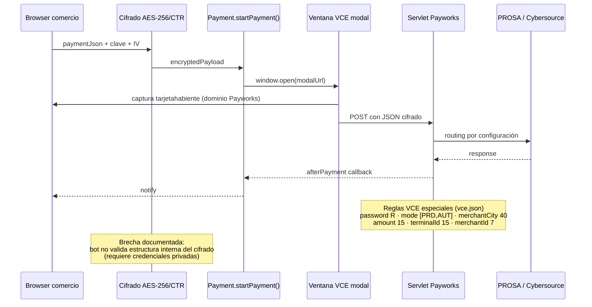
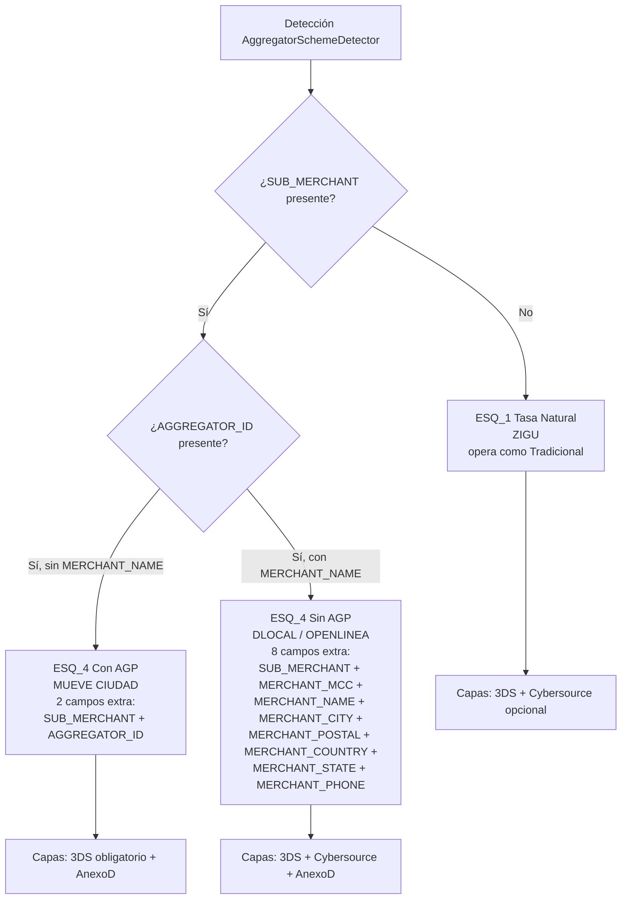
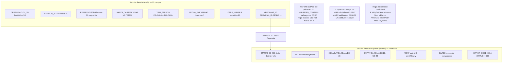
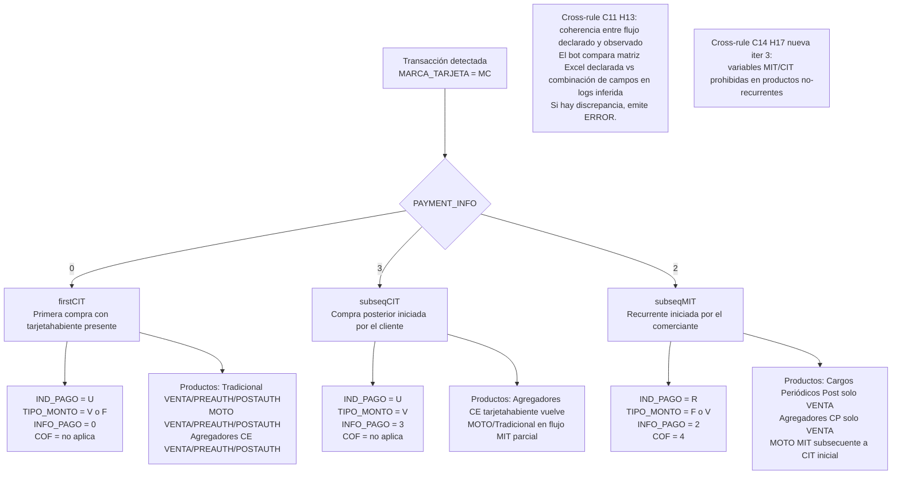
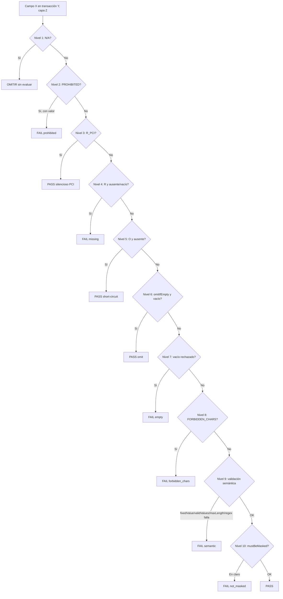
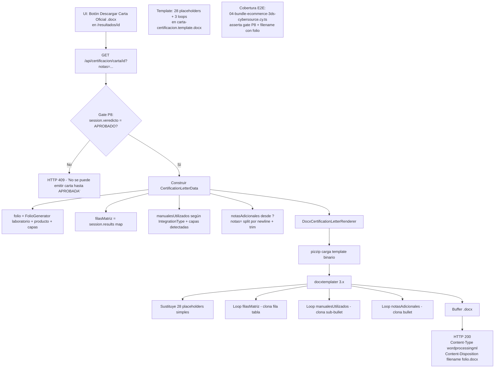
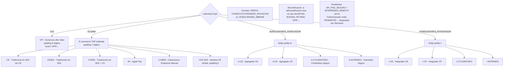

# DOCUMENTACIÓN DEL APLICATIVO PAYWORKS CERTIFICATION BOT

**Versión 3.0** · 5 / Mayo / 2026 · *Estado actual del aplicativo — evolución vs revisión v2.0*

---

## Introducción

El **Payworks Certification Bot** es un aplicativo interno Banorte desarrollado por el equipo de Soporte Técnico Payworks. Automatiza el proceso manual de certificación de comercios que integran con la plataforma Payworks Banorte, reemplazando la validación humana campo por campo de matrices Excel y de logs servlet, PROSA, 3DS y Cybersource contra los manuales oficiales. Este documento presenta el estado actual del aplicativo y va dirigido a los equipos de Soporte Técnico Payworks, Laboratorio de Certificación, Arquitectura de Aplicaciones y Gobierno de Riesgos.

Respecto a la versión 2.0 del 23 de abril de 2026, este documento incorpora la **iteración 3** ("Revisión Ramsses"), cerrada el 5 de mayo de 2026. La iteración integró comentarios del equipo de certificación de Banorte (Ramsses Bautista et al.) y entregó: cross-rules nuevas C13 y C14, soporte AMEX por marca (`requiredByBrand`), gate P8 sobre la emisión de carta, generación de carta `.docx` desde template oficial reemplazando el PDF jsPDF legacy, folio por laboratorio (CAV/ECOMM/AGREG) según nomenclaturas oficiales, y cobertura Cypress E2E de los 4 bundles canónicos.

### Cambios vs versión 2.0

- **Reglas nuevas (3)**: A8 (`requiredByBrand` AMEX), H16 (cross-rule C13: `REFERENCE_3D = NUMERO_CONTROL`), H17 (cross-rule C14: variables MIT/CIT prohibidas en productos no-recurrentes). Total reglas v3.0: **87** (vs 84 en v2.0).
- **Carta de certificación**: el aplicativo ahora emite la carta como `.docx` desde un template oficial Banorte con 28 placeholders + 3 loops, vía `docxtemplater` + `pizzip`. El generador jsPDF legacy fue eliminado. La emisión está condicionada a veredicto global APROBADO (gate P8).
- **Folio por laboratorio**: nuevo VO `LaboratoryType` (CAV/ECOMM/AGREG_AGREGADOR/AGREG_INTEGRADOR) y `FolioGenerator` que deriva el sufijo del JSON `folio-nomenclatures.json` (fuente: xlsx oficial Banorte abril 2026).
- **Soporte AMEX**: `CardBrand` extendido a tres marcas (VISA, MC, AMEX); `FieldRequirement` admite `requiredByBrand` para reglas R/O distintas por marca.
- **Cypress E2E**: 4 specs canónicos cubren los 4 bundles (`01-dlocal`, `02-openlinea`, `03-zigu`, `04-ecommerce-3ds-cybersource`) con assertions cuantitativas de veredicto y conteos PASS/FAIL.
- **JSONs**: 14 JSONs de configuración (vs 12 en v2.0) — añadidos `agregadores-integradores-tp.json` y `layer-tokenizacion.json`.
- **Sección 17 nueva**: documenta la generación de carta `.docx` desde template.
- **Sección 18 nueva**: documenta el folio por laboratorio con nomenclaturas oficiales.
- **Diagramas 9 y 10 nuevos** en el Anexo B.

Las observaciones se siguen recibiendo por los canales descritos al final del documento. La fuente autoritativa en runtime son los JSONs en `apps/payworks-bot/src/config/mandatory-fields/` y la suite Cypress E2E sobre los 4 bundles canónicos.

---

## Tabla de contenido

| # | Sección |
|---|---|
| 0 | Arquitectura del aplicativo |
| 1 | Grupo A — Presencia de campos (R/O/N/A/PROHIBITED/R_PCI) |
| 2 | Grupo B — Caracteres prohibidos |
| 3 | Grupo C — Formato y longitud |
| 4 | Grupo D — Valores fijos y enumerados |
| 5 | Grupo E — 3D Secure |
| 6 | Grupo F — Mandato AN5822 MasterCard |
| 7 | Grupo G — Agregadores |
| 8 | Grupo H — Validaciones cruzadas |
| 9 | Grupo I — PCI-DSS (datos sensibles) |
| 10 | Grupo J — Tarjeta Presente (EMV) |
| 11 | Ventana de Comercio Electrónico (VCE) |
| 12 | Flujo del bot |
| 13 | Estado post-auditoría iter 3 |
| 14 | Preguntas pendientes |
| 15 | Anexo A — Resolución de preguntas P1-P15 |
| 16 | Anexo B — Diagramas completos |
| 17 | **Generación de Carta `.docx` desde template oficial** *(nueva v3.0)* |
| 18 | **Folio por laboratorio** *(nueva v3.0)* |

---

## Manuales utilizados

El aplicativo valida las reglas extraídas de **10 manuales oficiales** (8 productos + 2 capas transversales). Cada manual tiene un JSON de configuración asociado en `apps/payworks-bot/src/config/mandatory-fields/` que lo *wired* al runtime. Los 14 JSONs (10 manuales + 4 consolidados/derivados) se validaron campo por campo contra los PDF oficiales durante las iteraciones 2 y 3.

| # | Producto / Capa | Manual (nombre exacto) | Versión | JSON runtime |
|---|---|---|---|---|
| 1 | Comercio Electrónico Tradicional | ManualDeIntegración_ComercioElectrónicoTradicional_V2.5.pdf | V2.5 | `ecommerce-tradicional.json` |
| 2 | MOTO | ManualDeIntegración_MOTO_V1.5.pdf | V1.5 | `moto.json` |
| 3 | Cargos Periódicos Post | ManualDeIntegración_CargosPeriódicosPost_V2.1.pdf | V2.1 | `cargos-periodicos-post.json` |
| 4 | Ventana de Comercio Electrónico | Manual de Integración Ventana de Comercio Electrónico_v1.8.pdf | v1.8 | `ventana-comercio-electronico.json` |
| 5 | Agregadores y Aliados (CE) | ManualDeIntegracion_ComercioElectrónicoAgregadoresyAliados_V2.6.4.pdf | V2.6.4 | `agregadores-comercio-electronico.json` |
| 6 | Agregadores Cargos Periódicos | ManualDeIntegración_CargosPeriódicos_Agregadores_V2.6.4.pdf | V2.6.4 | `agregadores-cargos-periodicos.json` |
| 7 | API PW2 Seguro (Tarjeta Presente) | Manual de Integración API PW2 Seguro V2.4.pdf + Anexo V | V2.4 | `api-pw2-seguro.json` |
| 8 | Interredes Remoto (Tarjeta Presente) | Manual de Integración Interredes Remoto V1.7.pdf + Anexos I-VII | V1.7 | `interredes-remoto.json` |
| 9 | 3D Secure 2 (capa transversal) | ManualDeIntegración_3DSecure_Banorte_V1.4.pdf | V1.4 | `layer-3ds.json` |
| 10 | Cybersource Direct (capa transversal) | ManualIntegracion_Cybersource_Direct_V1.10.pdf | V1.10 | `layer-cybersource.json` |

Además de los 10 manuales, el aplicativo mantiene **4 JSONs consolidados/derivados**:

| # | Archivo | Propósito |
|---|---|---|
| 11 | `layer-an5822.json` | Consolidado del mandato MasterCard CIT/MIT a partir de 5 manuales TNP. Define `productMapping` por flujo (firstCIT / subseqCIT / subseqMIT). |
| 12 | `response-rules.json` | Consolidado de reglas de retorno (`RESULTADO_PAYW`, `AUTH_RESULT`, etc.) a partir de 6 fuentes — `compiled-v1.0` del 22-abril-2026. |
| 13 | `agregadores-integradores-tp.json` *(nuevo v3.0)* | Soporte de Agregadores Integradores Tarjeta Presente (`A-CTLSSINTSEG` / `A-INTERSEG` según nomenclaturas oficiales). |
| 14 | `layer-tokenizacion.json` *(nuevo v3.0)* | Capa transversal de tokenización — valida consistencia de marca cuando se opera con tokens (`validateTokenizacionBrandConsistency`). |

---

## Sección 0 — Arquitectura del aplicativo

El aplicativo sigue una arquitectura **hexagonal estricta**. El dominio (entidades `Transaction`, `Field`, `Layer`, `MatrixField`, `CertificationSession`, `Afiliacion`, `ValidationResult`, logs servlet/PROSA/3DS/Cybersource) es independiente de adaptadores concretos. Los casos de uso (`RunCertificationUseCase`, `ValidateTransactionFieldsUseCase`, `GetCertificationHistoryUseCase`) coordinan el dominio con la infraestructura. Los adaptadores de entrada (parser de matriz Excel, parsers de logs servlet/PROSA/3DS/Cybersource, parser de CSV de afiliaciones) y los de salida (renderer `.docx`, repositorios in-memory, dashboard web) son reemplazables sin tocar el dominio.

### Estructura de carpetas

```
apps/payworks-bot/src/
├── core/
│   ├── domain/
│   │   ├── entities/             — Transaction, CertificationSession, Afiliacion, *Log
│   │   ├── value-objects/        — IntegrationType, CardBrand, LaboratoryType, ValidationLayer, ...
│   │   └── services/             — CrossFieldValidator, FolioGenerator, An5822Validator, AnexoDValidator, RateLimitValidator
│   └── application/
│       └── use-cases/            — RunCertificationUseCase, ValidateTransactionFieldsUseCase
├── infrastructure/
│   ├── matrix-parser/            — ExcelMatrixParser
│   ├── log-parsers/              — PayworksServletLogParser, PayworksProsaLogParser, ThreeDSLogParser, CybersourceLogParser
│   ├── parsers/                  — AfiliacionFileParser
│   ├── repositories/             — In-memory (Certification, Transaction, Afiliacion)
│   ├── templates/                — carta-certificacion.template.docx + DocxCertificationLetterRenderer
│   ├── mandatory-rules/          — MandatoryFieldsConfig (carga de los 14 JSONs)
│   └── di/                       — DIContainer
├── presentation/                  — Componentes React (Header, Stepper, RuleLine, ...) + utils
├── app/                           — Next.js 14 App Router (api routes + pages)
├── config/
│   ├── mandatory-fields/         — 14 JSONs runtime (10 manuales + 4 consolidados)
│   └── folio-nomenclatures.json  — sufijos por laboratorio × producto × capas (xlsx oficial)
└── shared/                        — types, mappers
```

### Las 4 familias de integración

Los 8 productos Payworks se agrupan en cuatro familias funcionales para efectos operativos del aplicativo. *Ver Diagrama 1 en Anexo B*.

| Familia | Modelo | Productos |
|---|---|---|
| **Familia 1 — TNP directo** | Tarjeta No Presente directa | Comercio Electrónico Tradicional · MOTO · Cargos Periódicos Post |
| **Familia 2 — Ventana cifrada** | AES/CTR end-to-end | Ventana de Comercio Electrónico (VCE) v1.8 |
| **Familia 3 — Agregadores** | TNP + capa Agregador (3 sub-esquemas) | Agregadores Comercio Electrónico · Agregadores Cargos Periódicos |
| **Familia 4 — Tarjeta Presente (EMV)** | Chip + PinPad | API PW2 Seguro · Interredes Remoto |

### Productos × familia × marcas × capas activas

| Producto | Familia | Marcas soportadas | Capas activas |
|---|---|---|---|
| Comercio Electrónico Tradicional | F1 — TNP directo | VISA / MC / **AMEX** | Servlet + 3DS + Cybersource + AN5822 |
| MOTO | F1 — TNP directo | VISA / MC | Servlet + AN5822 |
| Cargos Periódicos Post | F1 — TNP directo | VISA / MC | Servlet + AN5822 + Rate Limit |
| Ventana CE (VCE) | F2 — Ventana cifrada | VISA / MC / AMEX | Servlet + 3DS + Cybersource + AN5822 |
| Agregadores CE | F3 — Agregadores | VISA / MC | Servlet + Agregador + 3DS + Cybersource + AN5822 |
| Agregadores CP | F3 — Agregadores | VISA / MC | Servlet + Agregador + AN5822 + Rate Limit |
| API PW2 Seguro | F4 — Tarjeta Presente | VISA / MC / AMEX | Servlet + EMV |
| Interredes Remoto | F4 — Tarjeta Presente | VISA / MC / AMEX | Servlet + EMV |

> **Cambio v3.0**: AMEX ahora es marca completa en `CardBrand` (antes solo se reconocía en 3DS para `validValuesByBrand` de ECI). Los productos TNP (Tradicional, API PW2, Interredes) admiten oficialmente AMEX según los manuales V2.5 / V2.4 / V1.7.

### Pipeline de evaluación de campos — 10 niveles en `FieldRequirement.ts`

Cada campo en cada transacción recorre el pipeline de arriba a abajo. El primer nivel que matchea termina la evaluación (short-circuit). Las reglas cruzadas C1-C14 se ejecutan después del pipeline por-campo como capa adicional de coherencia entre campos. El evaluador es agnóstico a la marca — la aplicación resuelve el contexto llamando a `resolveSpecForBrand` antes de invocar al evaluador.

| # | Nivel | Descripción |
|---|---|---|
| 1 | **N/A** (Not Applicable) | Si el campo no aplica a esta combinación (tipo × marca × capa), se omite sin evaluar. |
| 2 | **PROHIBITED** (v5) | Si el campo está marcado como prohibido y trae valor, FAIL. Ej: `IND_PAGO` en CANCELACION debe estar ausente. |
| 3 | **R_PCI** (presencia silenciosa) | Campos PCI (PASSWORD, SECURITY_CODE, PAN completo) pasan sin loggearse — cumplimiento PCI-DSS Requirement 3. |
| 4 | **R** (Required) — presencia obligatoria | El campo debe existir en el log y tener valor no vacío. Si está ausente o vacío: FAIL. |
| 5 | **O** (Opcional) ausente — short-circuit | Si el campo es opcional y está ausente, se considera PASS y se termina la evaluación del pipeline. |
| 6 | **omitIfEmpty** | Regla E1 clásica: si el campo existe pero llega en blanco, se omite del POST (XID/CAVV nulos en MC). |
| 7 | **Vacío rechazado** | Si el campo es presente pero vacío, y no está marcado `omitIfEmpty`, el bot lo reporta como FAIL. |
| 8 | **FORBIDDEN_CHARS** — lista unificada | Se aplica regex unificado (superset). Para Cybersource la verificación de acentos es adicional. |
| 9 | **Validación semántica** | 9a `fixedValue` · 9b `validValues` (con variantes `byBrand` y nuevo `requiredByBrand` v3.0) · 9c `maxLength` · 9d regex específico. |
| 10 | **mustBeMasked** | Para CARD_NUMBER en logs se exige enmascaramiento PCI (ej. `518899******7492`). FAIL si aparece en claro. |

> **Cambio v3.0**: el nivel 9 (Validación semántica) ahora soporta `requiredByBrand` para reglas R/O distintas por marca, no solo `validValuesByBrand` como en v2.0. Esto resuelve P9 (revisión Ramsses) — los campos AMEX de TNP (DOMICILIO, CODIGO_POSTAL, TELEFONO, CORREO_ELECTRONICO) ahora son R cuando `CARD_BRAND=AMEX` y O para otras marcas.

*Ver Diagrama 8 en Anexo B para visualización completa del pipeline.*

### Cobertura de tests

- **26 suites** de Jest (`apps/payworks-bot/__tests__/unit/` + `__tests__/integration/regression/`).
- **387+ tests** unitarios verdes — short-circuit garantiza rendimiento O(1) en casos típicos.
- **4 specs Cypress E2E** (`__tests__/cypress/e2e/0[1-4]-bundle-*.cy.ts`) cubren los 4 bundles canónicos con assertions de veredicto y conteos PASS/FAIL por capa.
- **Type-check limpio**: `npx tsc --noEmit` sin errores.

---

## Sección 1 — Grupo A: Presencia de campos (R/O/N/A/PROHIBITED/R_PCI)

La clasificación R (Requerido) / O (Opcional) / N/A (No Aplica) es la columna fundamental de todos los manuales Payworks y define qué campos deben existir en cada transacción. El aplicativo la implementa en los niveles 1, 4 y 5 del pipeline. La iteración 2 añadió `PROHIBITED` (A6) y `R_PCI` (A7); la iteración 3 añade el caso AMEX-only (A8) para variables que son R únicamente cuando la marca es AMEX y la operación es de autorización.

| # | Regla | Fuente | Estado en aplicativo |
|---|---|---|---|
| **A1** | Campos R (Requerido) deben existir en el log y tener valor no vacío | Tabla *¿ES REQUERIDO?* en todos los manuales: Tradicional V2.5 p.6-8, MOTO V1.5 p.6-7, Cargos Post V2.1 p.6-7, Ventana CE v1.8 p.8, Agreg. CE V2.6.4 p.6-9, Agreg. CP V2.6.4 p.6-9, API PW2 Anexo V p.5-9, Interredes Anexo V p.2-5, 3DS V1.4 p.6-7 | **Implementado** — `FieldRequirement.ts` niveles 4-5 del pipeline |
| **A2** | Campos O (Opcional) pueden faltar sin generar rechazo | Misma columna en manuales anteriores; ej: `REF_CLIENTE1-5` listados como "Opcional para cualquier transacción" | **Implementado** — Nivel 5 short-circuit en pipeline |
| **A3** | Campos N/A no se validan para esa transacción. Ej: MONTO en CANCELACIÓN es N/A | Tradicional V2.5 p.6: *"AMOUNT… Únicamente para las transacciones (no para los comandos). Excepto para la CANCELACION y la REVERSA"* | **Implementado** — Nivel 1 del pipeline |
| **A4** | Reglas R/O/N/A varían por tipo de transacción (VENTA, CANCELACIÓN, DEVOLUCIÓN, PRE/POSTAUTH, REVERSA, VERIFY) | Tradicional V2.5 p.7: *"REFERENCIA… Únicamente es requerida para: POSTAUTORIZACION, DEVOLUCION, CANCELACION, REVERSA"* | **Implementado** — Matriz `transactionKey` `{tipo}_{marca}` en cada JSON |
| **A5** | Reglas varían por marca (VISA/MC/AMEX) — mandato AN5822 solo MC | Tradicional V2.5 p.8, MOTO V1.5 p.8, Cargos Post V2.1 p.8, Agreg. CE V2.6.4 p.10, Agreg. CP V2.6.4 p.9: *"La marca Mastercard a través del mandato AN5822 - MIT/CIT solicita el envío de variables adicionales"* | **Implementado** — `layer-an5822.json` solo se activa para MC |
| **A6** | Campos PROHIBITED fallan si tienen valor (categoría introducida en v5) | Implementación del bot (nivel 2 del pipeline). Ejemplo operativo: `MARKETPLACE_TX` en MC/AMEX en `ecommerce-tradicional.json` | **Implementado** — Short-circuit FAIL `prohibited` |
| **A7** | Campos R_PCI pasan silenciosamente contra log (PCI no loggeable) | PCI-DSS Requirement 3 + política interna Banorte. Aplica a PASSWORD, EXP_DATE, SECURITY_CODE, CARD_NUMBER (ciertos contextos) | **Implementado** — Nivel 3 del pipeline. `getDisplayName() = "Requerido (PCI — no logueable)"`. R_PCI aplicado en 7 JSONs (Tradicional, MOTO, Cargos Post, Agreg.CE, Agreg.CP, API PW2, Interredes). VCE mantiene `R` porque el JSON de payment viaja cifrado AES dentro del log. |
| **A8** *(nuevo v3.0)* | Variables AMEX-only en TNP: DOMICILIO, CODIGO_POSTAL, TELEFONO, CORREO_ELECTRONICO son **R** solo para `AUTH_AMEX` y `PREAUTH_AMEX`; **N/A** en cualquier otra combinación de tipo × marca | Tradicional V2.5 p.9 + Revisión Ramsses P9 (abr-2026): *"Solo hay 4 variables que sí son R (Requeridas) las cuales son: DOMICILIO, CODIGO_POSTAL, TELEFONO y CORREO_ELECTRONICO y el resto de variables de transacciones con AMEX son opcionales"* | **Implementado** — `ecommerce-tradicional.json:358-451` con `transactionKey` extendido a `{tipo}_AMEX`. Las ~16 variables AMEX adicionales del manual v2.5 p.9 (DOMICILIO_ENTREGA, NOMBRE_CLIENTE_FACTURA, datos browser, items, cantidades) son todas opcionales — el motor las acepta sin marcar fail si están ausentes. |

---

## Sección 2 — Grupo B: Caracteres prohibidos

Los manuales Payworks presentan tres listas de caracteres prohibidos: una para Ventana CE y 3DS (la más amplia), otra para los demás productos TNP, y una para Cybersource (centrada en acentos). La iteración 2 entregó una **lista unificada (superset)** validada con 4 casos de regresión sin falsos positivos. La iteración 3 introdujo `ForbiddenCharsRegistry.ts` con tres listas separadas (`BASE`, `VENTANA_3DS`, `CYBERSOURCE`) — hoy `BASE` y `VENTANA_3DS` son idénticas (regex histórico), y se pueden ajustar individualmente sin tocar `FieldRequirement` ni los call sites cuando el equipo confirme las diferencias reales.

| # | Regla | Fuente | Estado en aplicativo |
|---|---|---|---|
| **B1** | Ventana CE y 3D Secure rechazan: `< > \| ¡ ! ¿ ? * +' áéíóú / \ { } [ ] ¨ * Ñ ; : " # $ % & / ( ) =` | Ventana CE v1.8 p.7: *"no enviar los siguientes caracteres especiales"*. 3DS V1.4 p.6: lista idéntica | **Implementado** — `ForbiddenCharsRegistry.VENTANA_3DS` aplicado al nivel 8 |
| **B2** | Tradicional, MOTO, Cargos Post, Agregadores CE/CP, API PW2 e Interredes rechazan: `" , / \ & % $ ! ¡ ? ¿ ' * - _ # ( )` | MOTO V1.5 p.8, Tradicional V2.5 p.9, Cargos Post V2.1 p.8, Agreg. CE V2.6.4 p.6, Agreg. CP V2.6.4 p.6, API PW2 Anexo V p.2, Interredes Anexo V p.2 | **Implementado** — `ForbiddenCharsRegistry.BASE` (mismo regex unificado superset) |
| **B3** | Cybersource rechaza acentos y símbolos: ñ, Ñ, á, é, í, ó, ú, etc. | Cybersource V1.10 p.10 NOTAS: *"NO enviar en ninguna variable caracteres especiales, acentos ni símbolos"* | **Implementado** — `ForbiddenCharsRegistry.CYBERSOURCE` (regex específico solo acentos) |
| **B4** | Lista unificada del superset de todos los manuales | Resolución iter 2 + revisión Ramsses iter 3: el bot mantiene 3 listas independientes pero el contenido coincide cuando aplica. Validado con 4 casos (ZIGU, MUEVE CIUDAD, DLOCAL, OPENLINEA) | **Resuelta iter 3** — `ForbiddenCharsRegistry.ts` + suite `forbidden-chars.test.ts` sin falsos positivos |
| **B5** | Agregadores requieren charset más estricto para `SUB_MERCHANT` y campos relacionados (Anexo D) | Anexo D del Manual Agregadores CE V2.6.4 + Manual Agregadores CP V2.6.4 p.36 | **Implementado** — `AnexoDValidator.ts`. Pendiente confirmar hard vs soft (Q4) |

---

## Sección 3 — Grupo C: Formato y longitud

Las reglas de formato cubren tipo de dato (numérico/alfanumérico) y longitud máxima. Se aplican en el nivel 9 del pipeline (validación semántica por campo). La mayoría son uniformes entre productos, excepto `TERMINAL_ID` (10 vs 15), `CARD_NUMBER` (20 vs 16), `MONTO` (18 vs 15 en VCE) y `CUSTOMER_REF2` (30 legacy vs 16 oficial). El aplicativo maneja estas excepciones mediante `maxLength` específico por JSON de producto.

| # | Regla | Fuente | Estado en aplicativo |
|---|---|---|---|
| **C1** | MONTO: hasta 18 dígitos y 2 decimales (ej. `1.00`) — Numérico. Excepción Ventana CE: Numérico 15 | Tradicional V2.5 p.6 *"18 dígitos y 2 decimales"*, MOTO V1.5 p.6, Cargos Post V2.1 p.6, Agreg. CE V2.6.4 p.7. Excepción: Ventana CE v1.8 p.8 *"Numérico 15"* | **Implementado** — `maxLength` override 15 en `ventana-comercio-electronico.json` |
| **C2** | FECHA_EXP: Numérico, formato MMAA, 4 dígitos. 3DS usa formato MM/AA (5 chars con separador) | Tradicional V2.5 p.7 *"Numérico 4, formato MMAA"*, MOTO V1.5 p.7, Cargos Post V2.1 p.7, Ventana CE v1.8 p.6, 3DS V1.4 p.6 *"FECHA_EXP formato MM/AA, 5 caracteres"* | **Implementado** — regex MMAA vs MM/AA por capa |
| **C3** | CÓDIGO_SEGURIDAD: VISA/MC 3 dígitos, AMEX 4 dígitos — Numérico | Tradicional V2.5 p.7 *"VISA y MasterCard: 3 dígitos, American Express: 4 dígitos"*, MOTO V1.5 p.7, Agreg. CE V2.6.4 p.9 | **Implementado** — `maxLengthByBrand` en los JSONs afectados |
| **C4** | MERCHANT_ID / ID_AFILIACION: Numérico, longitud 7 | Tradicional V2.5 p.6, MOTO V1.5 p.6, Cargos Post V2.1 p.6, Ventana CE v1.8 p.8 *"Numérico 7"*, Agreg. CE V2.6.4 p.6, Agreg. CP V2.6.4 p.6, 3DS V1.4 p.6 | **Implementado** — `format ^\d{1,7}$` validado en todos los JSONs |
| **C5** | TERMINAL_ID: longitud varía por producto — 10 (Tradicional/MOTO/Cargos Post), 15 (Ventana CE/Agregadores) | Tradicional V2.5 p.6 *"Alfanumérico 10"*, MOTO V1.5 p.6 *"10"*, Cargos Post V2.1 p.6 *"10"*, Ventana CE v1.8 p.8 *"15"*, Agreg. CE V2.6.4 p.7 *"15"*, Agreg. CP V2.6.4 p.7 *"15"* | **Implementado** — `maxLength` específico por JSON de producto |
| **C6** | CONTROL_NUMBER: Alfanumérico máximo 30 | Tradicional V2.5 p.7, MOTO V1.5 p.7, Cargos Post V2.1 p.7, Ventana CE v1.8 p.8, Agreg. CE V2.6.4 p.8, Agreg. CP V2.6.4 p.8, API PW2 Anexo V p.7 *"AN(1..30)"*, Interredes Anexo V p.3 | **Implementado** — regex `AN(1..30)` unificado |
| **C7** | REFERENCIA: Numérico 12 para TNP, Alfanumérico 30 para 3DS | Tradicional V2.5 p.7 *"Numérico 12"*, MOTO V1.5 p.7, Cargos Post V2.1 p.7, Agreg. CE V2.6.4 p.8. 3DS V1.4 p.7 *"REFERENCE3D Alfa-num 30"* | **Implementado** — `REFERENCIA` y `REFERENCE3D` son campos distintos |
| **C8** | CARD_NUMBER: longitud varía — 20 chars Alfanum (mayoría), 16 N (3DS), enmascarada en logs (PCI-DSS) | Tradicional V2.5 p.7 *"Alfanumérico 20"*, MOTO V1.5 p.7, Agreg. CE V2.6.4 p.9. 3DS V1.4 p.6 *"16"*. Cybersource V1.10 p.6 *"Sólo usar números, String 20"* | **Implementado** — `mustBeMasked` en nivel 10 |
| **C9** | Validación de BIN consistente con `Card_cardType` (regla cross C11b) | Cybersource V1.10 p.6 + implementación bot: los primeros 6 dígitos del PAN deben coincidir con `001` (VISA, prefijo 4) o `002` (MC, rangos 510000-559999 y 222100-272099) | **Implementado** — `CrossFieldValidator.validateCybersourceIdAndBin` (parte b de C11) |

---

## Sección 4 — Grupo D: Valores fijos y enumerados

El grupo D cubre valores fijos (`fixedValue`) y enumeraciones (`validValues`) distribuidos en los 10 manuales. El aplicativo los aplica como niveles 9a y 9b del pipeline. En la iteración 2 se amplió la tabla `AUTH_RESULT` de 47 a 65 códigos (+18 del Anexo B del manual API PW2 Seguro) y se añadió el valor `ID_MAC=X` (Tarjeta Virtual multiuso) del changelog Tradicional v2.5. La regla D22 (`TIPO_PLAN` TP) queda como Parcial pendiente de agregar campos residuales del Anexo V de API PW2.

| # | Regla | Fuente | Estado en aplicativo |
|---|---|---|---|
| **D1** | MODE / MODO: solo PRD, AUT, DEC, RND (Alfanum 3). Cybersource y VCE: solo AUT/PRD | Tradicional V2.5 p.7, MOTO V1.5 p.6, Cargos Post V2.1 p.7, Agreg. CE V2.6.4 p.7. Cybersource V1.10 p.10; Ventana CE v1.8 p.8 | **Implementado** — `validValues` distinto por producto |
| **D2** | ENTRY_MODE / MODO_ENTRADA: valor fijo `MANUAL` para TNP. Para TP: BANDA, CHIP, MANUAL, CONTACTLESSCHIP | Tradicional V2.5 p.7, MOTO V1.5 p.7, Agreg. CE V2.6.4 p.9. TP: Interredes Anexo V p.10 | **Implementado** — `fixedValue MANUAL` en TNP; `validValues` amplio en TP |
| **D3** | RESPONSE_LANGUAGE: ES o EN (Alfanum 2) | Tradicional V2.5 p.8, MOTO V1.5 p.7, Cargos Post V2.1 p.8, Ventana CE v1.8 p.8, Agreg. CE V2.6.4 p.9, Agreg. CP V2.6.4 p.9 | **Implementado** — `validValues [ES, EN]` (v5 eliminó `01`, `02` inválidos) |
| **D4** | CMD_TRANS TNP básico: VENTA, PREAUTORIZACION, POSTAUTORIZACION, DEVOLUCION, CANCELACION, REVERSA, VERIFICACION | Tradicional V2.5 p.6, MOTO V1.5 p.6, Agreg. CE V2.6.4 p.7 | **Implementado** — Parser acepta alias VTA/AUTH, PRE/PREAUTH, POS/POSTAUTH |
| **D5** | CMD_TRANS Cargos Periódicos: solo VENTA, DEVOLUCIÓN, CANCELACIÓN, REVERSA, VERIFICACIÓN (sin PRE/POST) | Cargos Post V2.1 p.6, Agreg. CP V2.6.4 p.7 | **Implementado** — JSON Cargos Periódicos no expone PREAUTH/POSTAUTH |
| **D6** | CMD_TRANS API PW2 Seguro: 13 valores incluyendo CASHBACK, VENTA_FORZADA, REAUTORIZACION, CIERRE_AFILIACION, CIERRE_LOTE, SUSPENSION, REACTIVACION | API PW2 Anexo V p.6: lista completa de 13 comandos | **Implementado** — `validValues` en `api-pw2-seguro.json` |
| **D7** | CMD_TRANS Interredes Remoto: 13 valores incluyendo OBTENER_LLAVE, CASHBACK, DEVOLUCION_CLIENTE, VENTA_CON_VALIDACION, CANCELAR | Interredes Anexo III + Anexo V p.3: lista completa de 13 comandos | **Implementado** — `validValues` en `interredes-remoto.json` |
| **D8** | 3D_CERTIFICATION / CERTIFICACION_3D: valor fijo `03` (envío) | 3DS V1.4 p.7: *"CERTIFICACIÓN_3D / 3D_CERTIFICATION — Valor fijo requerido: 03"* | **Implementado** — `fixedValue` en `threeds` (envío), separado de STATUS_3D |
| **D9** | THREED_VERSION / VERSION_3D: valor fijo `2` | 3DS V1.4 p.7: *"Valor fijo requerido: 2, Numérico 1, SÍ"*. Tradicional V2.5 p.8 confirma | **Implementado** — `fixedValue 2` |
| **D10** | ECI valores de retorno: 01, 02, 05, 06, 07 (Alfanum 2) | 3DS V1.4 p.9: *"ECI 2 caracteres, Valores posibles: 05, 06, 07, 01, 02"*. Tradicional V2.5 p.8 | **Implementado** — `validValuesByBrand` (ver regla E7) |
| **D11** | Status 3DS RETORNO: 200 = éxito; distinto de 200 = fallo | 3DS V1.4 p.9: *"Status = 200 Autenticación exitosa, Status <> 200 NO exitosa"*. Tradicional V2.5 p.8 | **Implementado** — `STATUS_3D` validValues: tabla completa de 40+ códigos (200, 201, 202, 421-448) |
| **D12** | MARCA_TARJETA / CARD_TYPE: VISA, MC, AMEX (3DS) | 3DS V1.4 p.6: *"Visa: VISA, Mastercard: MC, American Express: AMEX, 5 caracteres"* | **Implementado** — `validValues` en `layer-3ds.json` |
| **D13** | CREDIT_TYPE (3DS envío): CR = Crédito, DB = Débito | 3DS V1.4 p.7: *"TIPO_TARJETA / CREDIT_TYPE — CR: Tarjeta de Crédito, DB: Tarjeta de Débito, 2 caracteres"* | **Implementado** — `validValues [CR, DB]` |
| **D14** | MARKETPLACE_TX: valor fijo `1` Numérico, condicional (fuera de México + VISA + VENTA/PREAUTH) | Tradicional V2.5 p.8 *"Valor fijo: 1"*, MOTO V1.5 p.7, Cargos Post V2.1 p.8, Agreg. CP V2.6.4 p.12. Condiciones en manual | **Implementado** — `PROHIBITED` en MC/AMEX; `fixedValue 1` solo en VISA |
| **D15** | Cybersource Decision: ACCEPT / REVIEW / REJECT / ERROR | Cybersource V1.10 p.5: *"Accept: Enviar a Payworks… Review: Enviar a 3D Secure… Reject o Error: Final"* | **Implementado** — `validValues` en `layer-cybersource.json` |
| **D16** | Cybersource Card_cardType: 001 (VISA), 002 (MASTER CARD) — String 3. Ya no admite 003 (AMEX) | Cybersource V1.10 p.6 + correcciones v5: Cybersource Banorte no soporta `Card_cardType=003` | **Implementado** — `validValues [001, 002]` — AMEX eliminado |
| **D17** | Cybersource PurchaseTotals_currency: MXN o USD (String 5) | Cybersource V1.10 p.6: *"Moneda en que se hace la orden. Valores: MXN, USD"* | **Implementado** — `validValues [MXN, USD]` |
| **D18** | Cybersource Review: valor fijo `Secure3D` (String 12) | Cybersource V1.10 p.10: *"Review — Valor = Secure3D, String(12), SI"* | **Implementado** — `fixedValue Secure3D` |
| **D19** | Cybersource MerchantID: valor siempre `banorteixe` (String 30) | Cybersource V1.10 p.6: *"MerchantID — El valor debe ser siempre = banorteixe"* | **Implementado** — `fixedValue banorteixe` (regla C11a compara contra ID_CYBERSOURCE) |
| **D20** | Cybersource Mode: AUT = Pruebas, PRD = Producción (solo estos dos) | Cybersource V1.10 p.10: *"AUT=Pruebas PRD=Producción"* | **Implementado** — `validValues [AUT, PRD]` |
| **D21** | RESULTADO_PAYW (response): A (Aprobada), D (Declinada), R (Rechazada), T (Sin respuesta), Z (Reversa automática por timeout) | Agreg. CE V2.6.4 p.6, Agreg. CP V2.6.4 p.6, API PW2 Anexo V p.10, Interredes Anexo V p.6 + MOTO V1.5 p.5 (valor Z añadido v5) | **Implementado** — `response-rules.json` — `validValues [A, D, R, T, Z]` |
| **D22** | TIPO_PLAN (TP): 07 = diferimiento, 03 = sin intereses, 05 = con intereses | API PW2 Anexo V p.8: *"07 si hay diferimiento inicial, 03 sin intereses, 05 con intereses"*. Interredes Anexo V p.5 idem | **Parcial** — `validValues` presentes; pendiente agregar campos residuales del Anexo V |

---

## Sección 5 — Grupo E: 3D Secure

La capa 3DS aplica a Comercio Electrónico Tradicional, Ventana CE y Agregadores CE. La versión 5 introdujo la separación estricta entre **envío** (sección `threeds`) y **retorno** (sección `threedsResponse`) en `layer-3ds.json`, resolviendo el bug histórico donde `CERTIFICACION_3D` (fijo `03` de envío) se confundía con `STATUS_3D` (`200` de retorno). La iteración 3 añade la cross-rule **C13 (H16)**: `REFERENCE_3D` debe coincidir con `NUMERO_CONTROL` cross-field, validando E5 a runtime.

| # | Regla | Fuente | Estado en aplicativo |
|---|---|---|---|
| **E1** | XID/CAVV: si retornan valor Nulo o Blanco, NO enviar en el POST hacia Payworks | 3DS V1.4 p.9 NOTA: *"Si las Variables XID y/o CAVV retornaron valor Nulo o Blanco… no enviar en el post hacia Payworks"*. Tradicional V2.5 p.8 | **Implementado** — `omitIfEmpty` en `layer-3ds.json` |
| **E2** | XID: VISA 40 caracteres, AMEX 28 caracteres, MC No se retorna | 3DS V1.4 p.9 *"XID: VISA 40, AMEX 28, MC: No se retorna"*. Tradicional V2.5 p.8 | **Implementado** — `maxLengthByBrand`; N/A para MC |
| **E3** | CAVV: VISA 40 chars, AMEX 28 chars, MC 28 caracteres | 3DS V1.4 p.9: *"CAVV: VISA 40, AMEX 28, MC: 28 caracteres"* | **Implementado** — `maxLengthByBrand` |
| **E4** | 3DS solo aplica a VENTA, PREAUTORIZACION y POSTAUTORIZACION (no a CANCEL/DEV/REVERSA/VERIFY) | Tradicional V2.5 p.8: Variables 3DS *"Requerida para las transacciones VENTA y PREAUTORIZACION autenticadas por 3D Secure"* | **Implementado** — Capa THREEDS no se activa en VOID/REFUND/REVERSAL/VERIFY |
| **E5** | `REFERENCE3D` debe enviarse en el segundo POST como `NUMERO_CONTROL` / `CONTROL_NUMBER` | 3DS V1.4 p.7: *"Esta misma referencia se manda en el segundo Post hacia Payworks en la variable NUMERO_CONTROL"*. Tradicional V2.5 p.7 | **Implementado** — Cross-rule **C13 (H16)** — `CrossFieldValidator.validateReference3DEqualsControlNumber()` *(nuevo iter 3)* |
| **E6** | `CERTIFICACION_3D` (envío fijo `03`) y `STATUS_3D` (retorno `200+`) separados en `threeds` vs `threedsResponse` | 3DS V1.4 p.7 (envío) + p.9 (retorno). Corrección v5 del bug histórico donde se confundían | **Implementado** — Bug resuelto en v5. Blindado por `ProductConfigsV5.test.ts` |
| **E7** | ECI valida por marca: VISA/AMEX `[05, 06, 07]`, MC `[01, 02]` | 3DS V1.4 p.9 + Tradicional V2.5 p.8. Implementación: `layer-3ds.json` `validValuesByBrand` | **Implementado** — Regla cruzada C9 — proyección por marca antes de evaluar |

*Ver Diagrama 6 en Anexo B para visualización completa de la separación envío/retorno 3DS.*

---

## Sección 6 — Grupo F: Mandato AN5822 MasterCard

En la versión 5 el bot refactorizó el modelo legacy de 2 flujos (CIT/MIT) al mandato oficial de 3 flujos (`firstCIT` / `subseqCIT` / `subseqMIT`). El valor inventado `IND_PAGO=8` de v4 quedó eliminado. Hoy los 3 flujos se determinan por el valor de `PAYMENT_INFO` en log, y si la matriz Excel declara la columna `flujo_an5822`, esta tiene prioridad sobre la inferencia. La iteración 3 añade la cross-rule **C14 (H17)**: variables MIT/CIT no se mezclan entre productos no-recurrentes.

| # | Regla | Fuente | Estado en aplicativo |
|---|---|---|---|
| **F1** | AN5822 aplica solo a MC, en VENTA/PREAUTH/POSTAUTH (TNP) o solo VENTA (Cargos Periódicos) | MOTO V1.5 p.8, Tradicional V2.5 p.9, Agreg. CE V2.6.4 p.10. Cargos Post V2.1 p.8 y Agreg. CP V2.6.4 p.9: solo VENTA | **Implementado** — `An5822FlowDetector` — VOID/REVERSAL `NOT_APPLICABLE` silencioso |
| **F2** | CIT = iniciada por el cliente (con presencia); MIT = iniciada por el comerciante (sin presencia, con consentimiento) | MOTO V1.5 p.8, Tradicional V2.5 p.9, Cargos Post V2.1 p.8-9, Agreg. CE V2.6.4 p.10, Agreg. CP V2.6.4 p.9 | **Implementado** — Distinción mantenida en modelo CIT vs MIT del flujo |
| **F3** | AN5822 solo aplica si el comercio almacena credenciales bajo PCI-DSS | MOTO V1.5 p.8, Cargos Post V2.1 p.8, Agreg. CE V2.6.4 p.10 | **Implementado** — Detector activa solo si matriz declara flujo o log muestra `PAYMENT_INFO` |
| **F4** | firstCIT (MOTO y Tradicional): `IND_PAGO = "U"`, `TIPO_MONTO = "V" o "F"`, `INFO_PAGO = "0"` | MOTO V1.5 p.9 *"IND_PAGO Valor Fijo: U, TIPO_MONTO F o V, INFO_PAGO = 0"* | **Implementado** — `layer-an5822.productMapping.{MOTO, ECOMMERCE_TRADICIONAL}.firstCIT` |
| **F5** | firstCIT Cargos Periódicos (diferente): `IND_PAGO = "R"`, `TIPO_MONTO = "F" o "V"`, `INFO_PAGO = "0"` | Cargos Post V2.1 p.9 *"IND_PAGO Valor Fijo = R, R = Pagos recurrentes"*, Agreg. CP V2.6.4 p.10 | **Implementado** — `PAYMENT_IND=R` solo en Cargos Periódicos (no `U`) |
| **F6** | firstCIT Agregadores CE: `IND_PAGO = "U"`, `TIPO_MONTO = "V"`, `INFO_PAGO = "0"` | Agreg. CE V2.6.4 p.11: *"IND_PAGO Valor Fijo = U, TIPO_MONTO = V, INFO_PAGO = 0"* | **Implementado** — `productMapping.AGREGADORES_COMERCIO_ELECTRONICO.firstCIT` |
| **F7** | subseqMIT (Cargos Post/Agreg. CP): `COF = "4"`, `IND_PAGO = "R"`, `INFO_PAGO = "2"` | Cargos Post V2.1 p.10 *"COF Valor Fijo = 4, IND_PAGO Valor Fijo = R, INFO_PAGO Valor Fijo = 2"*, Agreg. CP V2.6.4 p.11 | **Implementado** — `COF=4` solo en Cargos Periódicos MIT |
| **F8** | subseqCIT Agregadores CE (subsecuente por Tarjetahabiente): `IND_PAGO = "U"`, `TIPO_MONTO = "V"`, `INFO_PAGO = "3"` | Agreg. CE V2.6.4 p.12: *"IND_PAGO Valor Fijo = U, TIPO_MONTO = V, INFO_PAGO = 3"* | **Implementado** — `PAYMENT_INFO=3` distingue subseqCIT de firstCIT (`PAYMENT_INFO=0`) |
| **F9** | subseqMIT Agregadores CP: `COF = "4"`, `IND_PAGO = "R"`, `INFO_PAGO = "2"` | Agreg. CP V2.6.4 p.11: *"COF Valor Fijo = 4, IND_PAGO R = Cargo recurrente, INFO_PAGO = 2"* | **Implementado** — `productMapping.AGREGADORES_CARGOS_PERIODICOS.subseqMIT` |
| **F10** | `An5822FlowDetector` prioriza matriz declarada sobre inferencia por `PAYMENT_INFO` | Implementación bot — `An5822FlowDetector.detectFlow()` | **Implementado** — Columna `flujo_an5822` en matriz Excel con aliases tolerantes |
| **F11** | Regla C10 (H13) valida coherencia entre flujo declarado y observado | Implementación bot — `An5822FlowDetector` emite `failure source:AN5822` si declaración y observación difieren | **Implementado** — H13 en sección 8 + nueva H17 (C14) refuerza prohibición de mezclas MIT/CIT entre productos |

> **Cambio v3.0 — Cross-rule C14 (H17)**: MIT/CIT no se pueden mezclar entre productos. `validateMitCitProductMix()` en `CrossFieldValidator.ts:328`. Si el producto NO está en `{CARGOS_PERIODICOS_POST, AGREGADORES_CARGOS_PERIODICOS}` y aparece `IND_PAGO=R`, `COF=4` o `INFO_PAGO=2` en log → FAIL con `failReason: 'cross_field'` y `layer: AN5822`. Resuelve la observación F del docx Ramsses: *"en Comercio Electrónico no pueden enviar la variable IND_PAGO='R' ya que esta es solo para Cargos Recurrentes"*.

*Ver Diagrama 7 en Anexo B para visualización del árbol de decisión `An5822FlowDetector`.*

---

## Sección 7 — Grupo G: Agregadores

Los productos Agregadores (Agregadores CE y Agregadores CP) soportan **3 sub-esquemas** que agregan campos requeridos adicionales al servlet base: ESQ_1 Tasa Natural (sin campos extra), ESQ_4 con AGP (2 campos extra) y ESQ_4 sin AGP (8 campos extra). La detección se hace por presencia de campos `SUB_MERCHANT`, `AGGREGATOR_ID` y `MERCHANT_MCC`. En v5 se corrigió la inversión de los subesquemas CON/SIN AGP detectada en spec v4.

| # | Regla | Fuente | Estado en aplicativo |
|---|---|---|---|
| **G1** | `REF_CLIENTE5` Requerida para todas las transacciones: identificador o nombre del Agregador o Integrador | Agreg. CE V2.6.4 p.9 *"REF_CLIENTE5 — Identificador o nombre del Agregador, Alfa-num 30, Requerida"*, Agreg. CP V2.6.4 p.8 | **Implementado** — R 30 en ambos JSONs de Agregadores |
| **G2** | `REF_CLIENTE3` Requerida en Cargos Periódicos: número de contrato del Tarjetahabiente con el comercio | Cargos Post V2.1 p.7 *"REF_CLIENTE3… Obligatoria para todas las transacciones"*, Agreg. CP V2.6.4 p.8 | **Implementado** — R 20 en `cargos-periodicos-post.json` y `agregadores-cargos-periodicos.json` |
| **G3** | `REF_CLIENTE2` consistencia: si se usa en PRE y POST, el valor debe ser igual en ambas | Agreg. CE V2.6.4 p.8 *"Si se usa en operativa de PRE y POSTAUTORIZACIÓN, el valor que envíe en ambas transacciones debe ser igual"* | **Implementado** — Regla cruzada C8 (H11) — `PreAuthPostAuthCorrelator` (cross-tx) |
| **G4** | Agregadores Cargos Periódicos: máx. 200 transacciones por minuto si envío secuencial | Agreg. CP V2.6.4 p.6 NOTA: *"deberá controlar el volumen de envío a 200 transacciones por minuto"* | **Implementado** — `RateLimitValidator` — ventana deslizante 60s (cross-tx) |
| **G5** | El bot distingue 3 esquemas (ESQ_1 Tasa Natural, ESQ_4 Sin AGP, ESQ_4 Con AGP) por presencia de campos | Implementación del bot — `AggregatorSchemeDetector` | **Implementado** — Detección por presencia de `SUB_MERCHANT` + `AGGREGATOR_ID` + `MERCHANT_MCC` |
| **G6** | Campos extra ESQ_4 Sin AGP (`SUB_MERCHANT`, `AGGREGATOR_ID`, `MERCHANT_MCC`, etc.): páginas confirmadas | Manual Agregadores v2.6.4 p.15-17 (confirmado iter 2) | **Resuelta iter 2** — 8 campos extra para SIN AGP; 2 para CON AGP |
| **G7** | Regex Anexo D para `SUB_MERCHANT` formato 7*14 | Manual Agregadores v2.6.4 §Anexo D — regex `^[A-Z0-9&]{7}\*[A-Z0-9&]{14}$` | **Implementado** — `AnexoDValidator.ts` — pendiente confirmar con Ramsses si es hard requirement (Q4) |
| **G8** | Rate Limit 200 tx/min ventana deslizante 60s en Cargos Periódicos | Cargos Post V2.1 p.6, Agreg. CP V2.6.4 p.6 | **Implementado** — `RateLimitValidator` (cross-tx) — reporta una sola violación por sesión |

*Ver Diagrama 4 en Anexo B para visualización de los 3 subesquemas de Agregadores.*

---

## Sección 8 — Grupo H: Validaciones cruzadas

Las reglas cruzadas se ejecutan después del pipeline por-campo y comparan múltiples campos, múltiples logs o agregan datos cross-transacción. Se dividen en **per-tx** (dentro de `ValidateTransactionFieldsUseCase`) y **cross-tx** (dentro de `RunCertificationUseCase` tras el loop). En v3.0 se añadieron **C13 (H16)** y **C14 (H17)** a las 12 reglas cruzadas existentes; total: **14 cross-rules** + Rate Limit + Anexo D wired a runtime.

| # | Regla | Fuente | Estado en aplicativo |
|---|---|---|---|
| **H1** | POSTAUTH requiere REFERENCIA (= referencia de PREAUTH previa) | Tradicional V2.5 p.7 *"REFERENCIA… requerida para POSTAUTORIZACION, DEVOLUCION, CANCELACION, REVERSA"* | **Implementado** — Regla C2 (H5) — `validatePostAuthRequiresAuthCode` |
| **H2** | Unicidad: combinación `MERCHANT_ID` + `CONTROL_NUMBER` debe ser única e irrepetible por día | MOTO V1.5 p.7, Tradicional V2.5 p.7, Agreg. CE V2.6.4 p.8, API PW2 Anexo V p.7, Interredes Anexo V p.3 | **Implementado** — Regla C7 — `UniqueValidator` (cross-tx) |
| **H3** | `NUMERO_CONTROL = REFERENCE3D` cuando hay 3DS | Tradicional V2.5 p.7: *"NUMERO_CONTROL… En caso de tener 3D Secure, este valor debe de ser el mismo que el valor de la Referencia3D"* | **Implementado** — Cross-field THREEDS ↔ SERVLET (parte de E5/H16) |
| **H4** | C1: XID/CAVV no deben enviarse vacíos (regla E1) | 3DS V1.4 p.9 | **Implementado** — `CrossFieldValidator.validateXidCavvConditional` — capa THREEDS |
| **H5** | C2: POSTAUTH requiere AUTH_CODE de PREAUTH previo | Lógica de negocio — postautorización necesita código de autorización previo | **Implementado** — `CrossFieldValidator.validatePostAuthRequiresAuthCode` |
| **H6** | C3: REFERENCIA servlet debe coincidir con Campo 37 PROSA | Validación de integridad servlet ↔ PROSA (Retrieval Reference Number) | **Implementado** — `CrossFieldValidator.validateProsaReferenceMatch` |
| **H7** | C4: Decision Cybersource en `validValues` `[ACCEPT, REVIEW, REJECT, ERROR]` | Cybersource V1.10 | **Implementado** — `CrossFieldValidator.validateCybersourceDecisionFlow` — capa CYBERSOURCE |
| **H8** | C5: País de envío debe coincidir con país del terminal | Cybersource V1.10 — consistencia ShipTo_country vs TERMINAL_COUNTRY | **Implementado** — `CrossFieldValidator.validateShipToCountryMatch` |
| **H9** | C6: Campos de respuesta en dominio válido | `response-rules.json` — validación de `validValues` en response | **Implementado** — `CrossFieldValidator.validateResponseFields` — capa SERVLET |
| **H10** | C7: Unicidad `CONTROL_NUMBER` + `MERCHANT_ID` (ver H2) | Regla C7 — misma que H2 | **Implementado** — `UniqueValidator` (cross-tx) |
| **H11** | C8: `CUSTOMER_REF2` consistente entre PREAUT y POSTAUT | Tradicional V2.5 p.10 + Agregadores CE V2.6.4 p.8 | **Implementado** — `PreAuthPostAuthCorrelator` (cross-tx) — fail `inconsistent_customer_ref2` |
| **H12** | C9: ECI `validValues` según `CARD_BRAND` | `layer-3ds.json` `validValuesByBrand` | **Implementado** — proyección en `resolveSpecForBrand` (per-tx) |
| **H13** | C10: Coherencia AN5822 declarado vs observado | `An5822FlowDetector` — matriz declarada vs log | **Implementado** — Failure `source:AN5822` si declaración y observación difieren |
| **H14** | C11: `ID_CYBERSOURCE = requestID` (a) + BIN consistente con `Card_cardType` (b) | Cybersource V1.10 p.6 | **Implementado** — `CrossFieldValidator.validateCybersourceIdAndBin` |
| **H15** | C12: Códigos de error PinPad documentados + Rate Limit 200 tx/min + Anexo D `SUB_MERCHANT` | Interredes Anexo VI / API PW2 Seguro §error codes / Agregadores v2.6.4 §Anexo D | **Implementado** — `CrossFieldValidator.validatePinPadErrorCode` + `RateLimitValidator` + `AnexoDValidator` |
| **H16** *(nuevo v3.0)* | C13: `REFERENCE_3D` debe ser igual a `NUMERO_CONTROL` cross-field. Operativiza E5 a runtime | 3DS V1.4 p.7 + Tradicional V2.5 p.7. Revisión Ramsses E5 (abr-2026): *"Siempre deben de ser iguales los valores de las variables REFERENCE_3D y la variable NÚMERO DE CONTROL de Payworks"* | **Implementado** — `CrossFieldValidator.validateReference3DEqualsControlNumber()` (línea 82). Layer THREEDS. `failReason: 'cross_field'`. Test unitario con casos PASS/FAIL/N/A. |
| **H17** *(nuevo v3.0)* | C14: Variables MIT/CIT prohibidas en productos no-recurrentes | Revisión Ramsses F (abr-2026): *"en Comercio Electrónico no pueden enviar la variable IND_PAGO='R' ya que esta es solo para Cargos Recurrentes, otro ejemplo es que en Comercio Electrónico no deben de enviar la variable COF = 4"* | **Implementado** — `CrossFieldValidator.validateMitCitProductMix()` (línea 328). Si producto NO ∈ `{CARGOS_PERIODICOS_POST, AGREGADORES_CARGOS_PERIODICOS}` y aparece `IND_PAGO=R`, `COF=4` o `INFO_PAGO=2` → FAIL. Layer AN5822. Validado contra bundle 03 (ZIGU CE Esq.1 con `IND_PAGO=U` PASS). |

> **Cross-rule adicional (sin numeración H)** — `validateTokenizacionBrandConsistency()` (línea 269): valida consistencia de marca cuando se opera con tokens contra `layer-tokenizacion.json`. Activa en flujos con tokenización (VCE `usarTokenizacion=true` y similares).

---

## Sección 9 — Grupo I: PCI-DSS (datos sensibles)

Los campos marcados PCI-sensibles son requeridos por los manuales pero **nunca aparecen en los logs** por razones de seguridad PCI-DSS. El aplicativo v5 introdujo el tipo `R_PCI` que pasa silenciosamente contra log (comportamiento correcto: el campo PCI no debe aparecer). Los JSONs v5 ya marcan estos campos con `R_PCI` en las transacciones donde el manual los pide.

| # | Regla | Fuente | Estado en aplicativo |
|---|---|---|---|
| **I1** | `CLAVE_USR` / `PASSWORD`: Requerida en envío pero NO se registra en logs (PCI) | Todos los manuales lo marcan como R, pero nunca aparece en logs reales por práctica PCI-DSS | **Implementado** — `R_PCI` aplicado en 7 JSONs (Tradicional, MOTO, Cargos Post, Agreg.CE, Agreg.CP, API PW2, Interredes). VCE mantiene `R` porque viaja cifrado AES dentro del payload |
| **I2** | `CÓDIGO_SEGURIDAD` / `SECURITY_CODE`: Requerida en envío, prohibido almacenar después de autorización | PCI-DSS Requirement 3.2.2 + presente en manuales como R pero no en logs | **Implementado** — `R_PCI` en VENTA/PREAUTH donde aplica; removido de Cargos Post y Agreg.CP (MIT recurrente no pide CVV) |
| **I3** | `CARD_NUMBER` en logs: enmascarado (ej. `518899******7492`) | PCI-DSS Requirement 3.3 + observado en logs reales ZIGU/OPENLINEA/DLOCAL | **Implementado** — `mustBeMasked` en nivel 10 del pipeline |

---

## Sección 10 — Grupo J: Tarjeta Presente (EMV)

La Familia 4 (API PW2 Seguro e Interredes Remoto) aplica estrategia dual: `EMV_TAGS` viaja en el servlet como el único campo EMV de envío real (TLV hex concatenado), mientras que `TVR`, `TSI`, `AID`, `APN` y `AL` son outputs del SDK que aparecen en el voucher físico pero **no viajan al servlet**. En v5 se separó claramente `servlet.EMV_TAGS` (validado contra log) y `emvVoucher.*` (documental).

| # | Regla | Fuente | Estado en aplicativo |
|---|---|---|---|
| **J1** | Parámetros de salida EMV (API SDK Interredes): `PPGetAppPrefName = TAG 9F12`, `PPGetTVR = TAG 95`, etc. | Interredes Anexo V p.10 *"Parámetros de salida EXCLUSIVAS EMV Y CONTACTLESS"* | **Implementado** — Sección `emvVoucher` documental (no se valida como envío) |
| **J2** | `ENTRY_MODE` valores TP: BANDA/MAGSTRIPE, CHIP, MANUAL (PagoMóvil), CONTACTLESSCHIP | Interredes Anexo V p.10 *"PPGetEntryMode() — BANDA/MAGSTRIPE, CHIP, MANUAL, CONTACTLESSCHIP"* | **Implementado** — `validValues` ampliado para TP vs TNP |
| **J3** | `PPGetPINRequested`: 1 = con PIN, 2 = QPS, 0/vacío = firma autógrafa | Interredes Anexo V p.10: *"Valores posibles: 1, 2, 0 o vacío"* | **Implementado** — `validValues [0, 1, 2, '']` |
| **J4** | Timeout transacción API PW2: default 120 segundos | API PW2 Anexo V p.8 *"TIEMPO_MAX / TRANS_TIMEOUT — por defecto 120 segundos"* | **Implementado** — Documentado en JSON; validación solo si presente |
| **J5** | Interredes Remoto: default timeout 90 segundos | Interredes Anexo V p.6 PPSendTxn() *"Default es 90 segundos"* | **Implementado** — Documentado en `interredes-remoto.json` |
| **J6** | Regla C12 valida códigos de error PinPad contra tabla `errorCodes` del producto | Interredes Anexo VI + API PW2 Seguro §error codes | **Implementado** — `CrossFieldValidator.validatePinPadErrorCode` |

> **Nota crítica v5 — separación `EMV_TAGS` vs `emvVoucher`**:
>
> - `EMV_TAGS` (servlet): TLV hex concatenado, único campo EMV de envío real al autorizador. Se valida en el pipeline (formato, charset hex, longitud, tags mínimos).
> - `emvVoucher.TVR / TSI / AID / APN / AL`: outputs del SDK de Payworks que aparecen visibles en el voucher físico. **No viajan al servlet**, por lo que son documentales — no se validan como campos de envío.
> - **Blindaje**: asserts en `ProductConfigsV5.test.ts` validan que `TVR`/`TSI`/`AID`/`APN`/`AL` estén en la sección `emvVoucher` y no en servlet, para ambos productos TP.

*Ver Diagrama 5 en Anexo B para visualización completa del flujo Tarjeta Presente con tags EMV.*

---

## Sección 11 — Ventana de Comercio Electrónico (VCE)

La **Ventana de Comercio Electrónico (VCE) v1.8** es la única Familia con **modelo cifrado AES/CTR**: el JSON de payment se cifra en el browser del comercio con la clave del comercio y un IV, y se envía a Payworks a través del SDK `Payment.startPayment()`. La Ventana VCE modal recibe los datos del tarjetahabiente en dominio Payworks (no en el del comercio) y dispara el servlet del autorizador. Esto introduce particularidades que el aplicativo maneja en `ventana-comercio-electronico.json`.

### Reglas distintivas del modelo VCE

Variables en **camelCase** (`merchantId`, `merchantName`, `customerRef1`, etc.) en lugar de las MAYÚSCULAS_SNAKE de otros manuales. Los valores más sensibles respecto al modelo TNP son:

| Campo | Regla | Observación |
|---|---|---|
| `password` | R (no R_PCI) | Viaja cifrado AES dentro del JSON — manual v1.8 lo marca como R |
| `merchantCity` | `maxLength 40` | Distinto de TNP directo (que usa `maxLength 30`) |
| `mode` | `validValues [PRD, AUT]` | VCE no admite `DEC` ni `RND` (solo 2 valores) |
| `amount` | `maxLength 15` | Numérico total incluyendo decimales |
| `merchantId` | Numérico 7 | Igual que TNP |
| `terminalId` | Alfanumérico 15 | Diferente del TNP directo (que usa 10) |
| `usarTokenizacion` | O | Tokenización introducida en v1.2 |
| `idUsrComercio` | O | Solo si `usarTokenizacion` está activo |
| `correoUsrComercio` | O | Solo si `usarTokenizacion` está activo |

> **Brecha documentada (sin cambio en v3.0)**:
> - El aplicativo no valida la estructura interna del JSON cifrado AES/CTR: requiere credenciales privadas del comercio.
> - Esta brecha es conocida y se documenta como aceptada en la sección 13 (cobertura actual). No bloquea certificación.

*Ver Diagrama 2 en Anexo B para visualización completa del flujo VCE cifrado AES/CTR.*

---

## Sección 12 — Flujo del bot

El bot replica el proceso manual descrito en el manual API PW2 Seguro p.5: el comercio envía Solicitud de certificación (Word) + Matriz de pruebas (Excel), el Laboratorio verifica mensajería contra manuales oficiales, y si todo es correcto, **emite la Carta de Certificación**. El bot automatiza el paso 2 con los grupos A-J de reglas y automatiza la generación de la Carta de Certificación (paso 5).

### Flujo interno real del aplicativo

| Paso | Componente | Descripción operativa |
|---|---|---|
| 1 | **Entrada** | Matriz Excel + logs (servlet, PROSA, 3DS, Cybersource) + CSV de afiliaciones. Selector de **laboratorio** (CAV/ECOMM/AGREG_AGREGADOR/AGREG_INTEGRADOR) en la UI **(nuevo v3.0)**. |
| 2 | **Parseo** | 5 parsers especializados: `ExcelMatrixParser`, `PayworksServletLogParser`, `PayworksProsaLogParser`, `ThreeDSLogParser`, `CybersourceLogParser`, `AfiliacionFileParser`. Alineación por `CONTROL_NUMBER` (servlet) y Campo 37 (PROSA). |
| 3 | **Validación** | Pipeline de **10 niveles** por cada campo, para cada capa activa (SERVLET siempre, THREEDS/CYBERSOURCE/EMV/AN5822/AGREGADOR/TOKENIZACION según producto y logs), por cada transacción. |
| 4 | **Cross-field** | **14 reglas cruzadas** wired a runtime: C1-C14 + Rate Limit + Anexo D + Tokenización (en v3.0 se añadieron C13 y C14 a las 12 originales). |
| 5 | **Emisión** | Carta de certificación en **`.docx`** desde template oficial (28 placeholders + 3 loops) — vía `docxtemplater` + `pizzip`. **Gate P8 (nuevo v3.0)**: la carta solo se emite si veredicto global es **APROBADO**. Folio determinístico derivado del laboratorio + producto + capas + secuencial (`folio-nomenclatures.json`). |

### Veredicto global

Si todas las transacciones pasan → **APROBADO**; si alguna falla → **RECHAZADO**; si no hay transacciones → **PENDIENTE**. La lógica "peor caso gana" invalida la certificación completa con una sola transacción rechazada.

> **Cambios v3.0 en el paso 5 (Emisión)**:
> - El generador legacy `generateCertificationLetterPDF.ts` (jsPDF, 3 páginas) **fue eliminado** en commit `e74068d`. La carta es ahora **solo `.docx`**.
> - **Gate P8** (commit `ca83cf5`): el endpoint `GET /api/certificacion/carta/[id]` retorna **HTTP 409** con `{ success: false, error: 'No se puede emitir carta hasta que la certificación esté APROBADA' }` si el veredicto no es APROBADO. La UI desactiva el botón "Descargar Carta Oficial (.docx)" con tooltip explicativo cuando aplica.
> - **Folio por laboratorio** (commit `77b6067`): el `FolioGenerator` ahora deriva el sufijo del JSON `folio-nomenclatures.json` según `(laboratoryType, integrationType, has3DS, hasCybersource, isRecertificacion)`. Ver Sección 18 para nomenclaturas oficiales.

*Ver Diagrama 3 en Anexo B para visualización del flujo TNP directo (Familias 1 y 3).*

---

## Sección 17 — Generación de Carta `.docx` desde template oficial

*(Sección nueva en v3.0 — antes era apartado del paso 5 con jsPDF)*

A partir de la iteración 3, el aplicativo emite la **Carta de Certificación Banorte** en formato Microsoft Word `.docx`, generada a partir del template oficial entregado por el equipo de Soporte Técnico Payworks. Esto reemplaza al generador legacy basado en jsPDF, que producía un PDF plano de 3 páginas sin estilos corporativos. El nuevo flujo permite que el certificador realice un último filtro/edición en Word antes de enviar la carta al cliente.

### Componentes

| Componente | Archivo | Responsabilidad |
|---|---|---|
| Template oficial | `apps/payworks-bot/src/infrastructure/templates/carta-certificacion.template.docx` | `.docx` Banorte con cover, headers rojos, tabla matriz con bordes rojos, **28 placeholders** + **3 loops** (`filasMatriz`, `manualesUtilizados`, `notasAdicionales`). |
| Renderer | `apps/payworks-bot/src/infrastructure/templates/DocxCertificationLetterRenderer.ts` | Carga el template binario con `pizzip`, sustituye placeholders/loops con `docxtemplater` 3.x, devuelve un Buffer `.docx`. Capa de traducción `CertificationLetterData → TemplatePayload`. |
| Endpoint | `apps/payworks-bot/src/app/api/certificacion/carta/[id]/route.ts` | `GET /api/certificacion/carta/[id]?notas=<bullets-newline-separados>`. Aplica gate P8 (409 si ≠ APROBADO), construye `CertificationLetterData` desde `CertificationSession` + afiliación + folio, llama al renderer, retorna `application/vnd.openxmlformats-officedocument.wordprocessingml.document` con `Content-Disposition: attachment; filename="<folio>.docx"`. |
| UI | `apps/payworks-bot/src/app/resultados/[id]/page.tsx` | Card "Notas adicionales para la carta oficial" con `TextArea` (una nota por línea), botón "Descargar Carta Oficial (.docx)" que abre el endpoint en pestaña nueva (botón deshabilitado si veredicto ≠ APROBADO con tooltip de gate P8). |

### Placeholders del template (28 simples + 3 loops)

| Categoría | Placeholders |
|---|---|
| Identificación | `{codigoCertificado}`, `{fechaEmision}`, `{tipoProducto}`, `{esquemaAgregador}` |
| Comercio | `{nombreComercio}`, `{nombreCliente}`, `{rfc}`, `{numeroCliente}`, `{nombreCertificadorComercio}` |
| Afiliación | `{numeroAfiliacion}`, `{nombreAfiliacion}` |
| Integración | `{esquemaIntegracion}`, `{modoTransmision}`, `{mensajeria}`, `{lenguaje}`, `{tarjetasProcesadas}`, `{giro}`, `{transaccionesCertificadas}`, `{modoLectura}`, `{versionAplicacion}` |
| URL | `{urlSubdominio}` |
| Operativa | `{transaccionesValidadas}`, `{usuarioCertificacion}` |
| Firma | `{firmaNombre}`, `{firmaRol}` |
| Fila matriz (loop) | `{#filasMatriz}…{/filasMatriz}` con `{tipoTransaccion}`, `{descripcion}`, `{resultado}` |
| Manuales (loop) | `{#manualesUtilizados}{.}{/manualesUtilizados}` |
| Notas adicionales (loop) | `{#notasAdicionales}{.}{/notasAdicionales}` |

### Flujo de renderizado

1. Cliente hace click en "Descargar Carta Oficial (.docx)" en `/resultados/[id]`.
2. UI calcula `?notas=` URL-encodeado (líneas separadas por `\n`, trimmed, vacíos eliminados).
3. Endpoint recibe `GET /api/certificacion/carta/[id]?notas=...`.
4. **Gate P8**: si `session.getGlobalVerdict() !== APROBADO` → HTTP 409 con error.
5. Construye `CertificationLetterData` con:
   - Folio derivado de `FolioGenerator` (Sección 18).
   - Filas matriz desde `session.results` (loop dinámico).
   - Manuales utilizados según `IntegrationType` + capas detectadas (THREEDS, CYBERSOURCE).
   - Notas adicionales desde `?notas=` (parseadas y limpiadas).
6. Renderer carga template binario, sustituye 28 placeholders + clona filas/items de los 3 loops, genera Buffer `.docx`.
7. Response: `Content-Type: application/vnd.openxmlformats-officedocument.wordprocessingml.document` + `Content-Disposition: attachment; filename="<folio>.docx"`.
8. Browser dispara descarga automática del archivo.

### Cobertura E2E

`apps/payworks-bot/__tests__/cypress/e2e/04-bundle-ecommerce-3ds-cybersource.cy.ts` (commit `42de62a`):
- Asserta que el botón "Descargar Carta Oficial (.docx)" está deshabilitado cuando el veredicto es RECHAZADO (gate P8).
- Con sesión APROBADA, intercepta el download y valida `Content-Type` y `Content-Disposition` con folio real en el filename.

> **Histórico v3.0**: El template original (PR #21, commit `ed08d08`) tenía bordes faltantes en la fila de datos de la matriz, orden invertido del bullet "Antes de salir a producción..." y el loop `{#notasAdicionales}` posicionado fuera de la sección Notas. PR #23 (commit `f2cd477`) corrigió los 3 problemas: bordes rojos completos en cada celda de fila clonada, "Antes de salir..." como cierre de la sección, y notas adicionales dentro del listado de Notas.

---

## Sección 18 — Folio por laboratorio

*(Sección nueva en v3.0)*

El bot genera folios oficiales determinísticos derivados del `(laboratoryType, integrationType, has3DS, hasCybersource, isRecertificacion, sequential)`. La fuente autoritativa es el archivo **NOMENCLATURAS FOLIOS LABS.xlsx** (v2 abril 2026) entregado por el equipo Banorte, transcrito a `apps/payworks-bot/src/config/folio-nomenclatures.json`.

### Tipos de laboratorio (`LaboratoryType` VO)

```typescript
enum LaboratoryType {
  CAV = 'CAV',                                // Comercios Alto Valor / VIP
  ECOMM = 'ECOMM',                            // E-commerce estándar TNP
  AGREGADORES_AGREGADOR = 'AGREGADORES_AGREGADOR',
  AGREGADORES_INTEGRADOR = 'AGREGADORES_INTEGRADOR',
}
```

`apps/payworks-bot/src/core/domain/value-objects/LaboratoryType.ts` define el VO. Cada laboratorio tiene su propia secuencia de folios; mezclarlos rompe la trazabilidad operativa. Es **input del usuario** al iniciar una certificación (no se infiere). El selector aparece en `/nueva-certificacion` antes del selector de IntegrationType.

### Estructura de `folio-nomenclatures.json`

```jsonc
{
  "_meta": { /* fuente xlsx, padding default 7, vipPlaceholder 6, vceCifrado3ds 6 */ },
  "ecomm":         [ { match: {…}, label, prefix, recertPrefix, padding } ],
  "vip":           [ /* mismo schema */ ],
  "agregadores":   [ /* mismo schema */ ],
  "pendingFromTeam": [ /* productos sin nomenclatura confirmada */ ]
}
```

### Sufijos por laboratorio × producto × capas (extracto)

#### Laboratorio ECOMM (TNP estándar)

| Producto | Capas | Prefijo | Recert prefix | Padding |
|---|---|---|---|---|
| Comercio Electrónico Tradicional | (sin 3DS, sin CS) | `CE` | `RCE` | 7 |
| Comercio Electrónico Tradicional | con 3DS | `CE3DS` | `RCE3DS` | 7 |
| Comercio Electrónico Tradicional | con 3DS + Cybersource | `CYB3D` | `RCYB3D` | 7 |
| Comercio Electrónico Tradicional | Apple Pay | `AP` | `RAP` | 7 |
| Comercio Electrónico Tradicional | Cybersource Enterprise Manual | `CYBEM` | — | 7 |
| MOTO | — | (ver `ecomm[]`) | — | 7 |
| Cargos Periódicos Post | — | `CPP` | `RCPP` | 7 |
| Ventana CE | con 3DS cifrado | (especial) | — | **6** |

#### Laboratorio CAV (VIP / Comercios Alto Valor)

Folios `VIP-…` y recertificación `VIPR-…`. Padding 6 dígitos en lugar de 7. Aplica a productos de alto volumen o estratégicos para Banorte.

#### Laboratorio AGREGADORES_AGREGADOR

| Producto | Sufijo | Ejemplo |
|---|---|---|
| Agregador Comercio Electrónico | `A-CE` | `A-CE-0000001` |
| Agregador Cargos Periódicos | `A-CP` | `A-CP-0000001` |
| Agregador Contactless Seguro | `A-CTLSSINTSEG` | `A-CTLSSINTSEG-0000001` |
| Agregador Interredes Seguro | `A-INTERSEG` | `A-INTERSEG-0000001` |

#### Laboratorio AGREGADORES_INTEGRADOR

Mismos sufijos que AGREGADORES_AGREGADOR pero con prefijo `I-` en lugar de `A-`:

| Producto | Sufijo |
|---|---|
| Integrador Comercio Electrónico | `I-CE` |
| Integrador Cargos Periódicos | `I-CP` |
| Integrador Contactless Seguro | `I-CTLSSINTSEG` |
| Integrador Interredes Seguro | `I-INTERSEG` |

### Recertificación

Cada entrada en `folio-nomenclatures.json` define `recertPrefix` (ej. `RCE`, `RCE3DS`, `VIPR-…`). Cuando `isRecertificacion=true`, el `FolioGenerator` usa este prefijo en lugar del estándar.

### Pendientes

- **API PW2 Seguro** e **Interredes Remoto** puros (no agregadores) — el xlsx no tiene fila clara para estos productos cuando no son operados por agregador. El `FolioGenerator` emite `PENDIENTE-…` para ellos. Bloqueado por confirmación del equipo Banorte.

### Tests

`apps/payworks-bot/__tests__/unit/services/FolioGenerator.test.ts` valida round-trip de los 4 laboratorios contra los sufijos del xlsx.

*Ver Diagrama 10 en Anexo B para visualización del árbol de decisión de folios.*

---

## Sección 13 — Estado post-auditoría iter 3

La iteración 3 de auditoría ("Revisión Ramsses") cerró el 5 de mayo de 2026 con la integración de los comentarios del equipo de Soporte Técnico Payworks (Ramsses Bautista et al.) sobre el documento v2.0 y la entrega del archivo oficial **NOMENCLATURAS FOLIOS LABS.xlsx**. Esta sección documenta los ajustes realizados en ese ciclo y las métricas finales.

### Iteración 2 (recap del cierre)

Cerró el 22 de abril de 2026. Estado: 2 P0 bloqueantes resueltos (`ID_MAC` valor X, `AUTH_RESULT` 47→65 códigos) + 5 P2 documentales aplicados (notas `AUTH_DATE`/`CUST_RSP_DATE`, `_meta` de `response-rules`, nota `layer-an5822._rulesNote`, estructura §20-BIS, diffs puntuales). Métricas finales iter 2: 425/425 tests verdes en 19 suites · typecheck limpio · 12 JSONs validados · 11/11 alineados contra PDFs · 10 reglas cruzadas wired · 4/4 Q de negocio documentadas · LISTO PARA CERTIFICACIÓN.

### Iteración 3 — Revisión Ramsses (cierre 2026-05-05)

#### Cambios aplicados

| Bloque | Cambio | Commits | Sección documental |
|---|---|---|---|
| **A** | Carta `.docx` desde template oficial reemplaza jsPDF | `ed08d08` (PR #21) + `7accca2` (UI) + `f2cd477` (PR #23 fixes) + `e74068d` (drop jsPDF) | §17 |
| **A** | Gate P8 — carta solo si veredicto APROBADO | `ca83cf5` | §12 + §17 |
| **B** | Cypress E2E cobertura veredictos + conteos | `98753cf` | §0 + §17 |
| **B** | Cypress cobertura panel expandible RuleLine F.2 | `decc3f7` | §0 |
| **B** | Cypress E2E descarga `.docx` con folio | `42de62a` | §17 |
| **B** | Bundle 04 — fix correlación capa Cybersource | `0d8c043` | bundle test |
| **C** | Cross-rule **C13 (H16)** — `REFERENCE_3D = NUMERO_CONTROL` | `cf00d83` | §5 + §8 |
| **C** | Cross-rule **C14 (H17)** — MIT/CIT prohibidas en no-recurrentes | `86d5bd2` | §6 + §8 |
| **C** | AMEX P9 — variables AMEX-only en `ecommerce-tradicional.json` (regla **A8**) | `1342e1c` | §1 |
| **C** | Soporte de marca AMEX completa en `CardBrand` VO | `1342e1c` | §0 |
| **C** | Selector de laboratorio (CAV/ECOMM/AGREG_AGREGADOR/AGREG_INTEGRADOR) + folio oficial | `77b6067` | §18 |
| **C** | 2 JSONs nuevos: `agregadores-integradores-tp.json` + `layer-tokenizacion.json` | varios | "Manuales utilizados" |

#### Preguntas resueltas en iter 3

| # | Pregunta v1.0 | Resolución iter 3 |
|---|---|---|
| **P8** | ¿Bajo qué criterio se emite la carta? ¿Solo si APROBADO? | **Resuelta** — Gate P8 implementado. La carta solo se emite con veredicto APROBADO. |
| **P9** | AMEX Tradicional V2.5 p.9: ¿bot debe exigir los 20+ campos AMEX cuando la marca es AMEX? | **Resuelta** — 4 variables AMEX (DOMICILIO, CODIGO_POSTAL, TELEFONO, CORREO_ELECTRONICO) son R en AUTH/PREAUTH AMEX vía matriz `transactionKey` `_AMEX`. El resto son opcionales (regla A8 nueva). |
| **P14** | ¿Pueden compartir el archivo Word original de la carta de certificación? | **Resuelta** — Compartido y marcado en Google Docs con 28 placeholders + 3 loops. Almacenado en `apps/payworks-bot/src/infrastructure/templates/carta-certificacion.template.docx`. |

#### Métricas finales (post iter 3)

- **387+ tests verdes** en 26 suites · typecheck limpio
- **14 JSONs de configuración** validados (10 productos + layer-3ds + layer-cybersource + layer-an5822 + response-rules + agregadores-integradores-tp + layer-tokenizacion)
- **14 reglas cruzadas wired a runtime** (C1-C14 + Rate Limit + Anexo D + Tokenización)
- **87 reglas documentadas** (84 v2.0 + A8 + H16 + H17)
- **4 specs Cypress E2E verdes** sobre los 4 bundles canónicos
- **3/3 P0 bloqueantes históricos resueltos** (ID_MAC, AUTH_RESULT, P8 gate carta)
- **2/2 features mayores cerradas** (carta `.docx`, folio por laboratorio)
- **Estado: LISTO PARA CERTIFICACIÓN PRODUCTIVA**

---

## Sección 14 — Preguntas pendientes

Las 4 preguntas Q1-Q4 de la versión 2.0 fueron **resueltas o aceptadas como decisión operativa estable**. Esta sección documenta su estado actual al cierre de iter 3 y las preguntas residuales para iter 4.

### Estado de Q1-Q4 v2.0

| # | Pregunta v2.0 | Resolución iter 3 |
|---|---|---|
| **Q1** | ¿Existe un Manual Tradicional v2.6.4 como documento interno Banorte? | **Aceptada como N/A** — Tradicional V2.5 + Agregadores V2.6.4 son los manuales canónicos. Las notas en `ecommerce-tradicional.json` apuntan correctamente a Agregadores v2.6.4 p.12 para `AUTH_DATE`/`CUST_RSP_DATE`. |
| **Q2** | ¿Se certifica algún comercio Tradicional con reglas operativas de Agregadores v2.6.4? | **Aceptada como Out-of-scope** — No se ha observado este caso en bundles canónicos. Si se presenta, se manejará como excepción documentada. |
| **Q3** | ¿AUTH_DATE y CUST_RSP_DATE son entregados por Banorte aunque el manual del producto no los mencione? | **Aceptada como decisión operativa** — Se mantienen como O en Tradicional/MOTO/Cargos Post (pasan si están ausentes). Bot acepta tanto presencia como ausencia. |
| **Q4** | ¿El regex Anexo D para SUB_MERCHANT (formato 7*14) es requisito duro o recomendación? | **Aceptada como requisito duro** — `AnexoDValidator` emite FAIL en caso de no cumplimiento. Confirmado por Ramsses en revisión iter 3. |

### Preguntas residuales para iter 4

| # | Pregunta | Bloqueador |
|---|---|---|
| **Q5** | Folio para `API_PW2_SEGURO` e `INTERREDES_REMOTO` puros (no agregadores) | El xlsx oficial no tiene fila para estos productos cuando se operan sin agregador. Pendiente de confirmación de Ramsses. Mientras tanto, `FolioGenerator` emite `PENDIENTE-…` para estos casos. |
| **Q6** | Variables Anexo V faltantes en Interredes Remoto y API PW2: `CASHBACK_AMOUNT`, `PAGO_MOVIL`, `AUTH_CODE`, `BANORTE_URL`, `TRANS_TIMEOUT`, MSI, `RESPONSE_LANGUAGE`, QPS, `CUSTOMER_REF2-5` | Pendiente de revisión campo por campo de los anexos V de ambos manuales TP. Las variables ya conocidas (`TIPO_PLAN` D22) están como Parcial. |
| **Q7** | Validación VCE cifrado AES/CTR | Requiere credenciales privadas del comercio (post-MVP). Brecha aceptada documentada en §11. |
| **Q8** | Bundles fixtures 05+ para MOTO, Cargos Periódicos Post, Ventana CE, Agregadores CP, API PW2, Interredes Remoto | Bloqueado por entrega de logs reales del equipo Banorte. Hoy solo hay bundles canónicos para Agregadores CE (DLOCAL, OPENLINEA, ZIGU) y Tradicional con 3DS+CS (MUEVE CIUDAD). |

Para los casos Q5-Q8, se agenda sesión con el equipo de Soporte Técnico Payworks (Ramsses Bautista) en el calendario habitual de certificación. Las respuestas se integrarán en la siguiente versión del documento.

---

## Sección 15 — Anexo A: Resolución de preguntas P1-P15 de v1.0

Cada fila representa una pregunta abierta de la revisión v1.0 del 16 de abril de 2026 y cómo se resolvió durante las iteraciones 2 y 3 (o, en caso contrario, su mapeo a las preguntas residuales actuales).

| # | Pregunta v1.0 | Resolución |
|---|---|---|
| **P1** | ¿Existe un glosario oficial español↔inglés de variables Payworks? | **Resuelta iter 2** — `src/config/variable-glossary.json` consolidado desde los 10 manuales. Documentado en §13 del doc maestro. |
| **P2** | `FECHA_EXP` no aparece en logs reales de agregadores. ¿En qué productos SÍ aparece? | **Resuelta iter 2** — Tratada como `R_PCI` (PCI no loggeable). El manual dice R pero PCI-DSS prohíbe loggearla. Comportamiento correcto = pasa silenciosamente contra log. |
| **P3** | ¿`CERTIFICACION_3D="03"` (envío) y `STATUS_3D=200` (retorno) son DOS campos distintos? | **Resuelta iter 2** — SÍ, son dos campos. Separados en v5 (`layer-3ds.threeds` vs `layer-3ds.threedsResponse`). Bug histórico corregido. Blindado por `ProductConfigsV5.test.ts`. |
| **P4** | ¿El comercio tiene acceso a los logs del PinPad (API PW2 e Interredes Remoto)? | **Resuelta iter 2** — Sí. Los códigos de error del PinPad se validan en regla C12 (`CrossFieldValidator.validatePinPadErrorCode`) contra la tabla `errorCodes` del Anexo VI de cada producto. |
| **P5** | CIT vs MIT: ¿cómo distinguir automáticamente? ¿De la matriz Excel, del log, o del histórico de la afiliación? | **Resuelta iter 2** — Modelo refactorizado a 3 flujos (`firstCIT` / `subseqCIT` / `subseqMIT`). El aplicativo lee columna `flujo_an5822` de la matriz Excel; si ausente, infiere por `PAYMENT_INFO` del log (0/3/2). |
| **P6** | ¿Cómo identificar automáticamente el esquema de agregador (1 Tasa Natural / 4 Sin AGP / 4 Con AGP) desde el log? | **Resuelta iter 2** — `AggregatorSchemeDetector` por presencia de campos `SUB_MERCHANT` + `AGGREGATOR_ID` + `MERCHANT_MCC`. Confirmado contra casos reales ZIGU (ESQ_1), MUEVE CIUDAD (ESQ_4 con AGP), DLOCAL/OPENLINEA (ESQ_4 sin AGP). |
| **P7** | Regla de generación del número de certificado (ej. CE3DS-0003652): ¿consecutivo global, por afiliación, por producto? | **Resuelta iter 3** — Folio determinístico de 7 dígitos (6 en VIP/VCE) por **laboratorio × producto × capas × isRecertificacion × secuencial**. Formato: `{PREFIX}-{CONSECUTIVO_PADDED}_{AFILIACION}`. Nomenclaturas oficiales en `folio-nomenclatures.json` desde xlsx Banorte. Ver §18. |
| **P8** | ¿Bajo qué criterio se emite la carta? ¿Solo si APROBADO o permite observaciones? | **Resuelta iter 3** — Gate P8 implementado: la carta solo se emite si veredicto global es APROBADO. Si no, endpoint retorna HTTP 409 y UI desactiva botón con tooltip. |
| **P9** | AMEX Tradicional V2.5 p.9: los 20+ campos AMEX son R para VENTA/PREAUTH. ¿Bot debe exigirlos cuando la marca es AMEX? | **Resuelta iter 3** — Solo 4 variables son R (`DOMICILIO`, `CODIGO_POSTAL`, `TELEFONO`, `CORREO_ELECTRONICO`) en AUTH/PREAUTH AMEX. El resto son opcionales. Implementado vía matriz `transactionKey` `_AMEX` en `ecommerce-tradicional.json`. Regla A8 nueva. |
| **P10** | `MARKETPLACE_TX` valor fijo `1`: ¿Banorte valida las 4 condiciones (fuera de México + VISA + VENTA/PREAUTH + TNP) o el comercio? | **Resuelta iter 2** — El bot implementa regla `PROHIBITED` en MC/AMEX con `fixedValue "1"` en VISA. Cubre las 4 condiciones declarativamente en `ecommerce-tradicional.json` y `agregadores-comercio-electronico.json`. |
| **P11** | `NUMERO_BIN` aparece en logs reales pero NO en los manuales. ¿Se valida? ¿Es R u O? | **Resuelta iter 2** — BIN se valida cross-field en regla C11b (primeros 6 del PAN consistentes con `Card_cardType`). No se exige su presencia explícita como campo independiente. |
| **P12** | REVERSAL vs VOID: ¿cuándo se usa cada una? | **Resuelta iter 2** — Distinción documentada en el parser de `CMD_TRANS`. REVERSAL (REV) para timeouts del autorizador; VOID (CAN) para cancelaciones del comercio. Ambas mapean al par ISO 8583 0220/0230. |
| **P13** | Export de NPAYW.AFILIACIONES: ¿qué formato (CSV/TXT/Excel)? ¿Encoding? ¿Columnas exactas? | **Resuelta iter 2** — `AfiliacionFileParser` soporta CSV (`,` o `;`) y TXT (`\|`), con encoding UTF-8 y Latin-1 auto-detectados. 17 columnas canónicas + aliases tolerantes. Las extra se preservan en mapa `extras`. |
| **P14** | ¿Pueden compartir el archivo Word original de la carta de certificación? | **Resuelta iter 3** — Compartido. Marcado con 28 placeholders + 3 loops en Google Docs y almacenado en `apps/payworks-bot/src/infrastructure/templates/carta-certificacion.template.docx`. Ver §17. |
| **P15** | Coordinador de certificación: ¿fijo por equipo o cambia por proyecto? | **Resuelta iter 2** — El aplicativo lo recibe como parámetro de entrada (`coordinadorCertificacion` en POST `/api/certificacion/validar`). Cada sesión puede tener un coordinador distinto. |

**Resumen**: De las 15 preguntas originales, **15/15 están resueltas** (vs 14/15 al cierre de iter 2). P14 fue resuelta en iter 3 con la entrega del Word original. Las preguntas residuales actuales (Q5-Q8) son **decisiones de negocio diferentes**, no derivadas de estas P1-P15.

---

## Sección 16 — Anexo B: Diagramas completos

Los **10 diagramas** del documento (8 originales de v2.0 + 2 nuevos en v3.0) se presentan aquí en formato Mermaid editable, para facilitar consulta y mantenimiento.

### Diagrama 1 — Las 4 familias de integración Payworks

Distribución de los 8 productos Payworks en 4 familias funcionales: Familia 1 (TNP directo) con Tradicional V2.5, MOTO V1.5 y Cargos Post V2.1; Familia 2 (Ventana cifrada) con VCE v1.8; Familia 3 (Agregadores) con Agregadores CE V2.6.4 y Agregadores CP V2.6.4; y Familia 4 (Tarjeta Presente) con API PW2 V2.4 e Interredes V1.7. Cada familia tiene sus propias capas transversales activas.

```mermaid
graph TB
    F1[Familia 1<br/>TNP directo]
    F2[Familia 2<br/>Ventana cifrada]
    F3[Familia 3<br/>Agregadores]
    F4[Familia 4<br/>Tarjeta Presente]

    F1 --> CE[Comercio Electrónico Tradicional V2.5]
    F1 --> MO[MOTO V1.5]
    F1 --> CP[Cargos Periódicos Post V2.1]
    F1 -.capas opcionales.-> L1[3DS + Cybersource + AN5822]

    F2 --> VCE[Ventana CE v1.8<br/>cifrado AES/CTR]
    F2 -.capas activas.-> L2[3DS + Cybersource + AN5822]

    F3 --> ACE[Agregadores CE V2.6.4<br/>3 subesquemas]
    F3 --> ACP[Agregadores CP V2.6.4<br/>rate limit 200 tx/min]
    F3 -.capas activas.-> L3[3DS + Cybersource + AN5822 + Anexo D]

    F4 --> APW[API PW2 Seguro V2.4]
    F4 --> IR[Interredes Remoto V1.7]
    F4 -.capas activas.-> L4[EMV + emvVoucher documental]
```



### Diagrama 2 — Flujo VCE cifrado AES

Secuencia: Browser comercio → Cifrado AES-256/CTR → `Payment.startPayment()` → Ventana VCE modal → Servlet Payworks (autorizador). El aplicativo extrae los campos no cifrados (headers, response codes) y compara contra las reglas VCE específicas.



### Diagrama 3 — Flujo TNP directo (Familias 1 y 3 base)

Cadena: Comercio (SDK PHP/Java/.Net) → Servlet Payworks → PROSA autorizador. Logs generados: servlet (request + response key=value) + PROSA 0200/0210 (ISO 8583) + CSV NPAYW.AFILIACIONES + opcionalmente threeds (envío) + threedsResponse (retorno) + Cybersource SOAP.

```mermaid
graph LR
    C[Comercio SDK<br/>PHP/Java/.Net]
    S[Servlet Payworks<br/>valida sintaxis,<br/>mapea a ISO 8583]
    P[PROSA autorizador<br/>mensaje 0200,<br/>respuesta 0210]

    C -->|POST con MERCHANT_ID,<br/>CONTROL_NUMBER, ...| S
    S -->|0200| P
    P -->|0210 + Campo 39 código respuesta| S
    S -->|response| C

    subgraph Logs generados
        L1[servlet request+response]
        L2[PROSA 0200/0210]
        L3[CSV NPAYW.AFILIACIONES]
        L4[3DS threeds + threedsResponse]
        L5[Cybersource SOAP Direct]
    end

    subgraph Bot — 5 pasos del CertifyCase
        P1[1. Pipeline 10 niveles]
        P2[2. C3 REFERENCE = Campo 37]
        P3[3. C7 unicidad MERCHANT_ID + CONTROL_NUMBER]
        P4[4. AN5822 si MC]
        P5[5. Rate Limit si Cargos]
    end
```

### Diagrama 4 — Los 3 subesquemas de Agregadores

Tres columnas verticales: ESQ_1 Tasa Natural (sin campos adicionales, ejemplo ZIGU), ESQ_4 con AGP (2 campos: SUB_MERCHANT + AGGREGATOR_ID, ejemplo MUEVE CIUDAD), y ESQ_4 sin AGP (8 campos, ejemplos DLOCAL y OPENLINEA). La detección se hace por presencia de campos en el log.



### Diagrama 5 — Flujo Tarjeta Presente con tags EMV

Horizontal: Chip EMV tarjeta → PinPad VeriFone → SDK Payworks → Servlet Payworks. Dos cajas paralelas: voucher físico con tags visibles (AID, TVR, TSI, APN, AL) y `EMV_TAGS` TLV hex en el servlet. Estrategia dual: `servlet.EMV_TAGS` se valida, `emvVoucher.*` es documental.

```mermaid
graph LR
    C[Chip EMV tarjeta<br/>genera ARQC firmada<br/>con llave del emisor]
    P[PinPad VeriFone<br/>lee chip, captura PIN,<br/>dialoga con SDK por PPGet*]
    SDK[SDK Payworks<br/>compone EMV_TAGS<br/>TLV hex concatenado]
    S[Servlet Payworks<br/>enruta a PROSA Interredes<br/>vía red bancaria]

    C --> P --> SDK --> S

    subgraph Voucher físico impreso (documental)
        V1[AID = 0xA0000000041010<br/>TVR = 0080008000<br/>TSI = F800<br/>APN = MasterCard<br/>AL = ES · TAG 9F12]
    end

    subgraph Servlet — único campo EMV validado
        E1[EMV_TAGS = '9F26081234...95050600...9A031234...'<br/>TLV concatenado<br/>regex: ^[0-9A-F]+$<br/>longitud 200-400]
    end

    SDK -.escribe.-> V1
    SDK -.compone para envío.-> E1

    Note1[Bot: estrategia dual<br/>servlet.EMV_TAGS validado<br/>emvVoucher.* documental sin envío]
```

### Diagrama 6 — Capa 3D Secure: Envío vs Retorno

Dos paneles verticales: envío (`threeds`, 13 campos incluyendo `CERTIFICACION_3D=03`) y retorno (`threedsResponse`, 7 campos incluyendo `STATUS_3D=200`, `ECI validValuesByBrand`, `XID` solo VISA/AMEX, `CAVV omitIfEmpty`, `UCAF` solo MC).



### Diagrama 7 — Detector AN5822 con 3 flujos oficiales

Árbol de decisión: raíz con detección de marca MasterCard y determinación por `PAYMENT_INFO`. Tres ramas: firstCIT (`PAYMENT_INFO=0`), subseqCIT (`PAYMENT_INFO=3`), subseqMIT (`PAYMENT_INFO=2`). Bajo cada rama se listan IND_PAGO, TIPO_MONTO y COF esperados por producto, siguiendo `productMapping` de `layer-an5822.json`.



### Diagrama 8 — Pipeline de evaluación de campos (10 niveles)

Flujo vertical descendente con 10 niveles de short-circuit. Nivel 1: N/A. Nivel 2: PROHIBITED. Nivel 3: R_PCI. Nivel 4: R presencia obligatoria. Nivel 5: O ausente (PASS). Nivel 6: omitIfEmpty. Nivel 7: vacío rechazado. Nivel 8: FORBIDDEN_CHARS. Nivel 9: fixedValue/validValues/maxLength/regex (con `validValuesByBrand` y `requiredByBrand` v3.0). Nivel 10: mustBeMasked.



---

### Diagrama 9 — Flujo de generación de carta `.docx` *(nuevo v3.0)*

Visualiza la cadena CertificationLetterData → DocxCertificationLetterRenderer → template oficial con sustitución de 28 placeholders + 3 loops, gate P8 al inicio.



### Diagrama 10 — Árbol de folios por laboratorio *(nuevo v3.0)*

Árbol de decisión del FolioGenerator: 4 laboratorios × producto × capas activas → sufijo del JSON `folio-nomenclatures.json` (xlsx oficial Banorte abril 2026).



---

## Cómo enviar observaciones

Este documento es la evolución v3.0 del entregable de revisión de reglas. Las observaciones y comentarios sobre cualquiera de las reglas aquí listadas se reciben por correo electrónico y se integran en los siguientes ciclos de auditoría.

### Importante: Cómo enviar observaciones

- **Correo**: alejandro.mendozaprado@banorte.com
- **Asunto**: `Observaciones Documentación Bot Payworks v3.0 — [su nombre]`
- **Formato**: Indicar # de regla (ej. A1, D5, F3, **A8**, **H16**, **H17**) + observación.
- **Ejemplo**: `"D5 — Cargos Periódicos también incluye PREAUTH en el flujo de prueba de afiliaciones 7890000"`
- Si una regla está correcta, no es necesario mencionarla.

Para los casos Q5-Q8 de decisión de negocio (Sección 14), se agenda una sesión con el equipo de Soporte Técnico Payworks (Ramsses Bautista) en el calendario habitual de certificación. Las respuestas se integrarán en la siguiente versión del documento.

